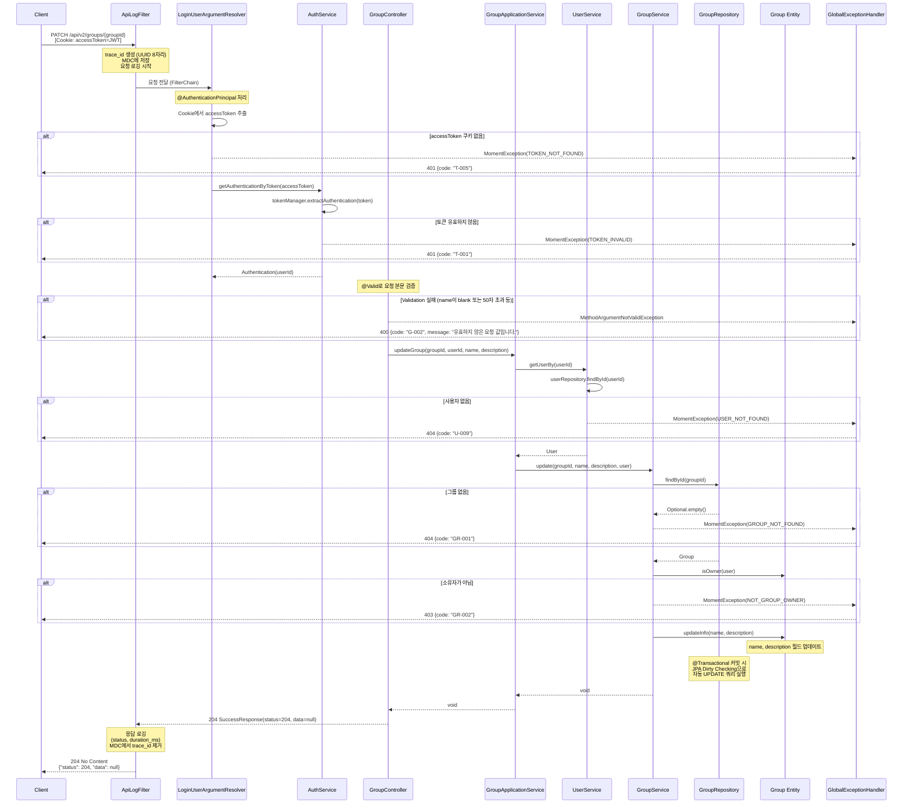

# 그룹 정보 수정 API 요청 처리 흐름

## API 개요

| 항목 | 값 |
|------|-----|
| **엔드포인트** | `PATCH /api/v2/groups/{groupId}` |
| **인증** | Cookie 기반 JWT (`accessToken`) |
| **성공 응답** | `204 No Content` |
| **권한** | 그룹 소유자만 가능 |

---

## 시퀀스 다이어그램



---

## 레이어별 처리 흐름 상세

### 1. Servlet Filter - 요청 로깅

> [ApiLogFilter.java:24-52](../server/src/main/java/moment/global/logging/ApiLogFilter.java#L24-L52)

모든 API 요청의 시작과 끝에서 로깅을 수행합니다.

- **시작 시**: `trace_id`(UUID 8자리) 생성, MDC에 저장, IP/Method/URI 로깅
- **종료 시**: 응답 status, 처리 시간(`duration_ms`) 로깅 후 MDC 정리
- Swagger 경로(`/swagger-ui/`, `/v3/api-docs`)는 로깅 제외

```
[시작] API Request Start  ip=x.x.x.x method=PATCH uri=/api/v2/groups/1
[종료] API Request End     ip=x.x.x.x method=PATCH uri=/api/v2/groups/1 status=204 duration_ms=45
```

---

### 2. Argument Resolver - 인증 처리

> [LoginUserArgumentResolver.java:18-49](../server/src/main/java/moment/auth/presentation/LoginUserArgumentResolver.java#L18-L49)

`@AuthenticationPrincipal Authentication` 파라미터를 해석합니다.

| 단계 | 설명 | 코드 위치 |
|------|------|-----------|
| 파라미터 지원 확인 | `Authentication` 타입 + `@AuthenticationPrincipal` 어노테이션 확인 | [L23-26](../server/src/main/java/moment/auth/presentation/LoginUserArgumentResolver.java#L23-L26) |
| 쿠키 추출 | `accessToken` 쿠키에서 JWT 토큰 값 추출 | [L36-48](../server/src/main/java/moment/auth/presentation/LoginUserArgumentResolver.java#L36-L48) |
| 토큰 검증 | `AuthService.getAuthenticationByToken()`으로 토큰 검증 및 `Authentication` 객체 반환 | [L33](../server/src/main/java/moment/auth/presentation/LoginUserArgumentResolver.java#L33) |

**등록 위치**: [WebConfig.java:22-24](../server/src/main/java/moment/global/config/WebConfig.java#L22-L24)

**Authentication DTO**: [Authentication.java:1-8](../server/src/main/java/moment/user/dto/request/Authentication.java#L1-L8) - `record Authentication(Long id)` userId만 포함하는 단순 record

---

### 3. Controller - 요청 수신 및 유효성 검증

> [GroupController.java:123-131](../server/src/main/java/moment/group/presentation/GroupController.java#L123-L131)

```java
@PatchMapping("/{groupId}")
public ResponseEntity<SuccessResponse<Void>> updateGroup(
        @AuthenticationPrincipal Authentication authentication,  // 2단계에서 해석
        @PathVariable Long groupId,
        @Valid @RequestBody GroupUpdateRequest request) {         // 유효성 검증
    groupApplicationService.updateGroup(groupId, authentication.id(), request.name(), request.description());
    HttpStatus status = HttpStatus.NO_CONTENT;
    return ResponseEntity.status(status).body(SuccessResponse.of(status, null));
}
```

**요청 DTO**: [GroupUpdateRequest.java:1-17](../server/src/main/java/moment/group/dto/request/GroupUpdateRequest.java#L1-L17)

| 필드 | 타입 | 검증 규칙 |
|------|------|-----------|
| `name` | `String` | `@NotBlank` + `@Size(max=50)` |
| `description` | `String` | `@Size(max=200)` (nullable) |

Validation 실패 시 `MethodArgumentNotValidException` -> [GlobalExceptionHandler.java:41-55](../server/src/main/java/moment/global/exception/GlobalExceptionHandler.java#L41-L55) 에서 처리

---

### 4. Application Service - 오케스트레이션

> [GroupApplicationService.java:65-69](../server/src/main/java/moment/group/service/application/GroupApplicationService.java#L65-L69)

```java
@Transactional
public void updateGroup(Long groupId, Long userId, String name, String description) {
    User user = userService.getUserBy(userId);       // 사용자 조회
    groupService.update(groupId, name, description, user);  // 그룹 수정 위임
}
```

여러 도메인 서비스를 조율하는 역할. `@Transactional`로 전체를 하나의 트랜잭션으로 묶습니다.

**사용자 조회**: [UserService.java:67-70](../server/src/main/java/moment/user/service/user/UserService.java#L67-L70) - 사용자 없으면 `USER_NOT_FOUND(U-009)` 예외

---

### 5. Domain Service - 비즈니스 로직 및 검증

> [GroupService.java:30-35](../server/src/main/java/moment/group/service/group/GroupService.java#L30-L35)

```java
@Transactional
public void update(Long groupId, String name, String description, User requester) {
    Group group = getById(groupId);              // 그룹 조회
    validateOwner(group, requester);             // 소유자 검증
    group.updateInfo(name, description);         // 엔티티 수정
}
```

| 단계 | 설명 | 실패 시 에러 | 코드 위치 |
|------|------|-------------|-----------|
| 그룹 조회 | `groupRepository.findById(groupId)` | `GROUP_NOT_FOUND (GR-001)` 404 | [L25-28](../server/src/main/java/moment/group/service/group/GroupService.java#L25-L28) |
| 소유자 검증 | `group.isOwner(requester)` 확인 | `NOT_GROUP_OWNER (GR-002)` 403 | [L44-48](../server/src/main/java/moment/group/service/group/GroupService.java#L44-L48) |
| 엔티티 수정 | `group.updateInfo(name, description)` | - | [L34](../server/src/main/java/moment/group/service/group/GroupService.java#L34) |

---

### 6. Domain Entity - 상태 변경

> [Group.java:21-64](../server/src/main/java/moment/group/domain/Group.java#L21-L64)

```java
@Entity
@Table(name = "moment_groups")
@SQLDelete(sql = "UPDATE moment_groups SET deleted_at = NOW() WHERE id = ?")
@SQLRestriction("deleted_at IS NULL")
public class Group extends BaseEntity {
    // ...
    public void updateInfo(String name, String description) {   // L52-55
        this.name = name;
        this.description = description;
    }

    public boolean isOwner(User user) {                          // L57-59
        return this.owner.getId().equals(user.getId());
    }
}
```

| 필드 | 컬럼 | 제약조건 |
|------|------|----------|
| `id` | `id` (PK) | `@GeneratedValue(IDENTITY)` |
| `name` | `name` | `NOT NULL`, `length=50` |
| `description` | `description` | `length=200` |
| `owner` | `owner_id` (FK -> User) | `NOT NULL`, `LAZY` |
| `deletedAt` | `deleted_at` | Soft Delete 용 |
| `createdAt` | (BaseEntity) | 자동 감사 |

- JPA Dirty Checking으로 `@Transactional` 커밋 시 자동으로 UPDATE 쿼리 실행

---

### 7. Repository - 데이터 접근

> [GroupRepository.java:12-14](../server/src/main/java/moment/group/infrastructure/GroupRepository.java#L12-L14)

```java
public interface GroupRepository extends JpaRepository<Group, Long> {
    Optional<Group> findById(Long id);
}
```

- `@SQLRestriction("deleted_at IS NULL")` 때문에 Soft Delete된 그룹은 자동 제외

---

### 8. 응답 생성

> [SuccessResponse.java:1-17](../server/src/main/java/moment/global/dto/response/SuccessResponse.java#L1-L17)

```java
public record SuccessResponse<T>(int status, T data) {
    public static <T> SuccessResponse<T> of(HttpStatus httpStatus, T data) {
        return new SuccessResponse<>(httpStatus.value(), data);
    }
}
```

성공 응답 본문:
```json
{
  "status": 204,
  "data": null
}
```

---

### 9. 에러 처리

> [GlobalExceptionHandler.java:13-80](../server/src/main/java/moment/global/exception/GlobalExceptionHandler.java#L13-L80)

이 흐름에서 발생 가능한 모든 에러:

| 에러 코드 | 메시지 | HTTP Status | 발생 위치 |
|-----------|--------|-------------|-----------|
| `T-005` | 토큰을 찾을 수 없습니다. | 401 | [LoginUserArgumentResolver.java:39,46](../server/src/main/java/moment/auth/presentation/LoginUserArgumentResolver.java#L39) |
| `T-001` | 유효하지 않은 토큰입니다. | 401 | [AuthService.java:50-52](../server/src/main/java/moment/auth/application/AuthService.java#L50-L52) (TokenManager 내부) |
| `G-002` | 유효하지 않은 요청 값입니다. | 400 | [GlobalExceptionHandler.java:41-55](../server/src/main/java/moment/global/exception/GlobalExceptionHandler.java#L41-L55) (Validation 실패) |
| `U-009` | 존재하지 않는 사용자입니다. | 404 | [UserService.java:67-70](../server/src/main/java/moment/user/service/user/UserService.java#L67-L70) |
| `GR-001` | 존재하지 않는 그룹입니다. | 404 | [GroupService.java:25-28](../server/src/main/java/moment/group/service/group/GroupService.java#L25-L28) |
| `GR-002` | 그룹 소유자가 아닙니다. | 403 | [GroupService.java:44-48](../server/src/main/java/moment/group/service/group/GroupService.java#L44-L48) |

에러 코드 정의: [ErrorCode.java:64-67](../server/src/main/java/moment/global/exception/ErrorCode.java#L64-L67)

---

## 관련 파일 전체 목록

| 레이어 | 파일 | 핵심 메서드/역할 |
|--------|------|-----------------|
| **Filter** | [ApiLogFilter.java](../server/src/main/java/moment/global/logging/ApiLogFilter.java) | `doFilter()` - 요청/응답 로깅 |
| **Config** | [WebConfig.java](../server/src/main/java/moment/global/config/WebConfig.java) | ArgumentResolver, Interceptor 등록 |
| **Auth Resolver** | [LoginUserArgumentResolver.java](../server/src/main/java/moment/auth/presentation/LoginUserArgumentResolver.java) | JWT 쿠키 추출 및 Authentication 반환 |
| **Auth Service** | [AuthService.java](../server/src/main/java/moment/auth/application/AuthService.java) | `getAuthenticationByToken()` - 토큰 검증 |
| **Auth DTO** | [Authentication.java](../server/src/main/java/moment/user/dto/request/Authentication.java) | `record Authentication(Long id)` |
| **Request DTO** | [GroupUpdateRequest.java](../server/src/main/java/moment/group/dto/request/GroupUpdateRequest.java) | name, description + validation |
| **Controller** | [GroupController.java](../server/src/main/java/moment/group/presentation/GroupController.java) | `updateGroup()` L123-131 |
| **Application Service** | [GroupApplicationService.java](../server/src/main/java/moment/group/service/application/GroupApplicationService.java) | `updateGroup()` L65-69 |
| **User Service** | [UserService.java](../server/src/main/java/moment/user/service/user/UserService.java) | `getUserBy()` L67-70 |
| **Domain Service** | [GroupService.java](../server/src/main/java/moment/group/service/group/GroupService.java) | `update()` L30-35, `validateOwner()` L44-48 |
| **Domain Entity** | [Group.java](../server/src/main/java/moment/group/domain/Group.java) | `updateInfo()` L52-55, `isOwner()` L57-59 |
| **Repository** | [GroupRepository.java](../server/src/main/java/moment/group/infrastructure/GroupRepository.java) | `findById()` L14 |
| **Response DTO** | [SuccessResponse.java](../server/src/main/java/moment/global/dto/response/SuccessResponse.java) | `of()` - 응답 래핑 |
| **Error Code** | [ErrorCode.java](../server/src/main/java/moment/global/exception/ErrorCode.java) | GR-001, GR-002 (L65-66) |
| **Exception Handler** | [GlobalExceptionHandler.java](../server/src/main/java/moment/global/exception/GlobalExceptionHandler.java) | MomentException, Validation 에러 처리 |

---

## 요청/응답 예시

### 성공 요청

```http
PATCH /api/v2/groups/1 HTTP/1.1
Content-Type: application/json
Cookie: accessToken=eyJhbGciOiJIUzI1NiJ9...

{
  "name": "변경된 그룹명",
  "description": "변경된 설명"
}
```

```http
HTTP/1.1 204 No Content
Content-Type: application/json

{
  "status": 204,
  "data": null
}
```

### 실패 응답 (소유자가 아닌 경우)

```http
HTTP/1.1 403 Forbidden
Content-Type: application/json

{
  "code": "GR-002",
  "message": "그룹 소유자가 아닙니다."
}
```
