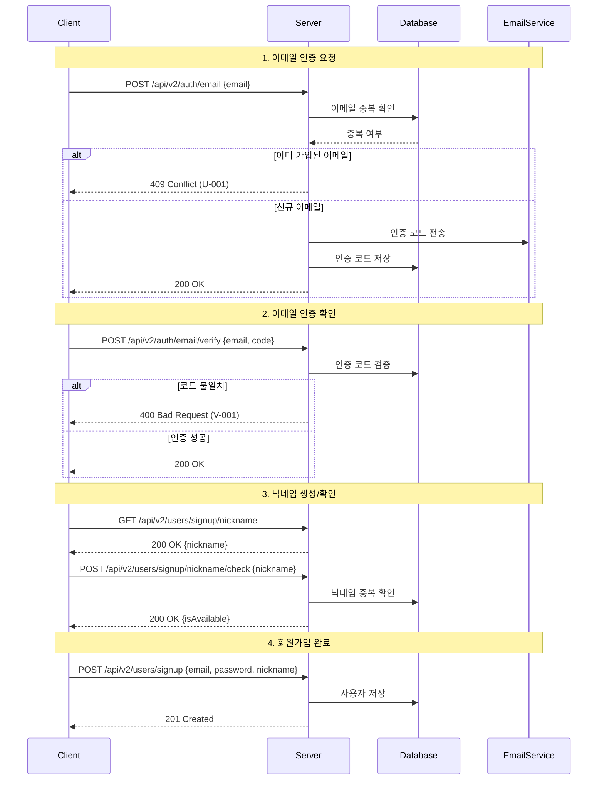
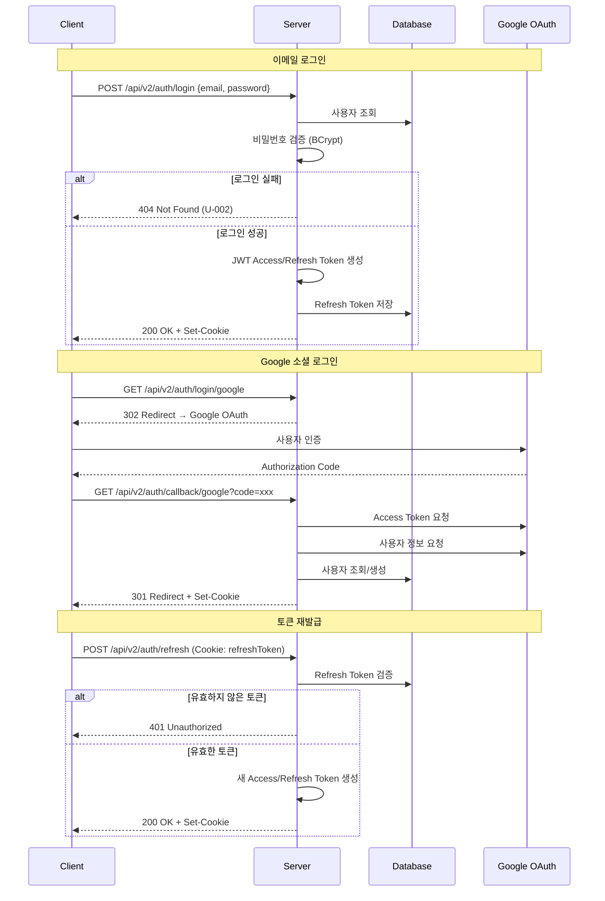
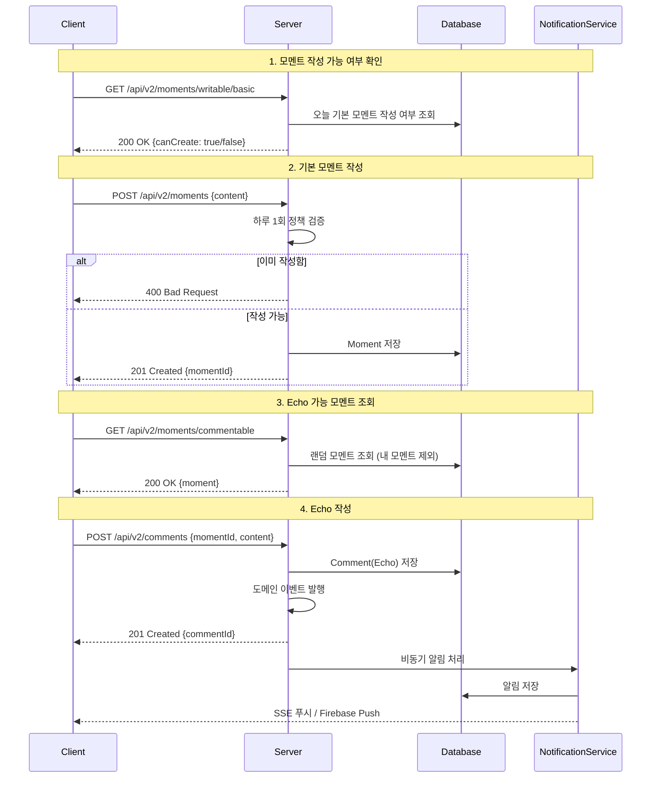
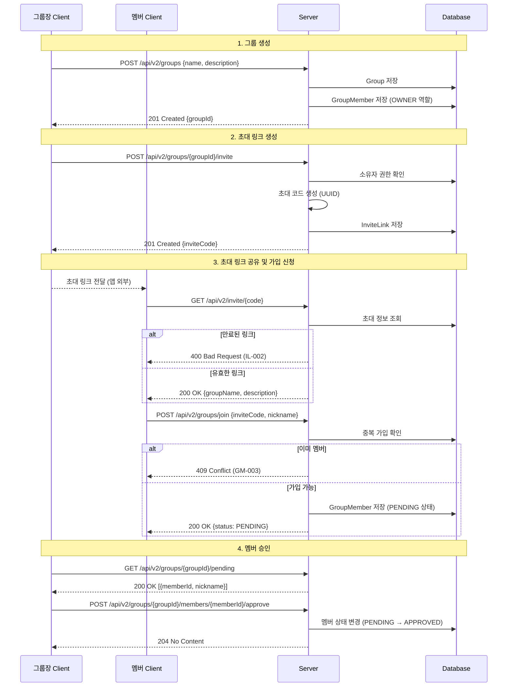
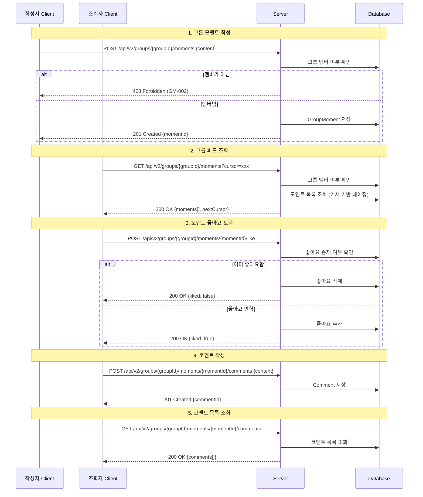
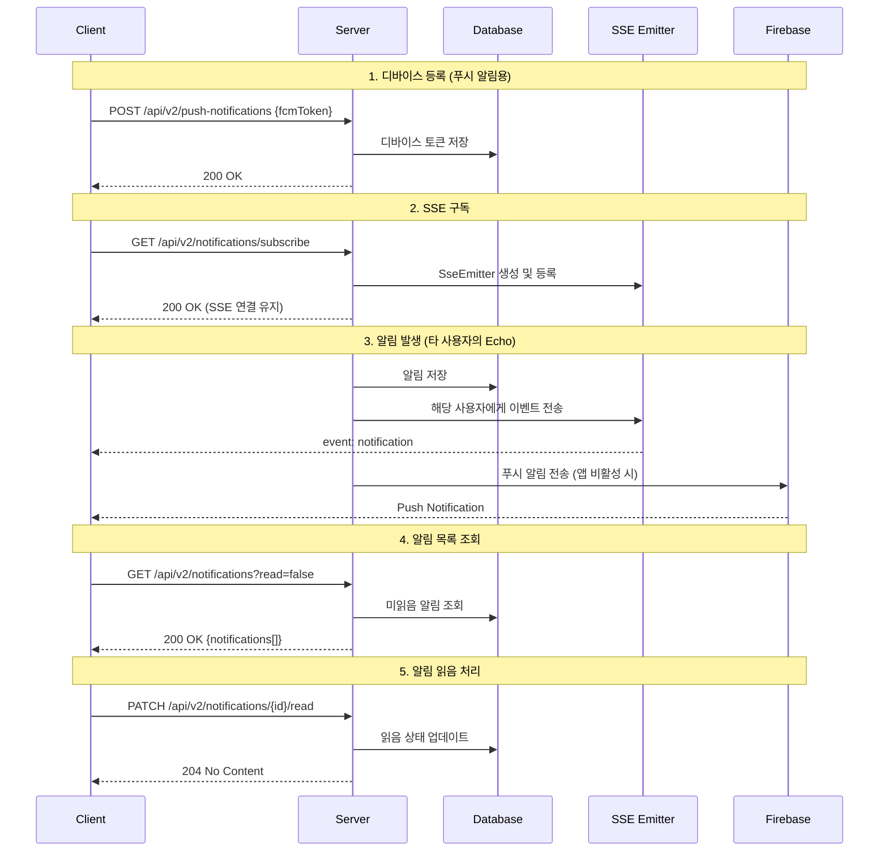
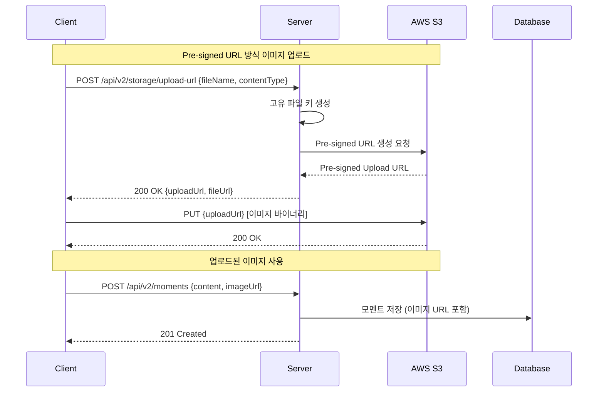
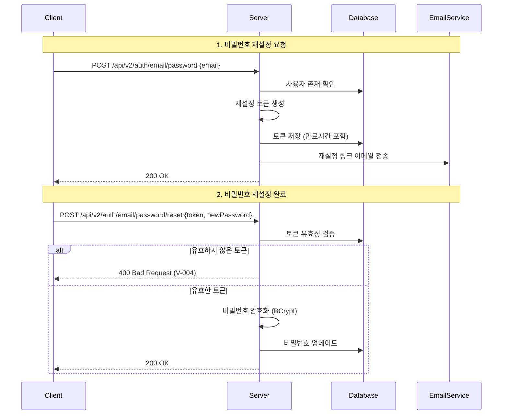
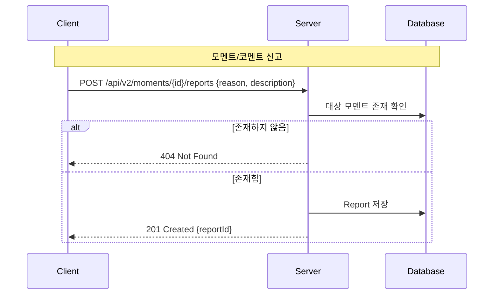
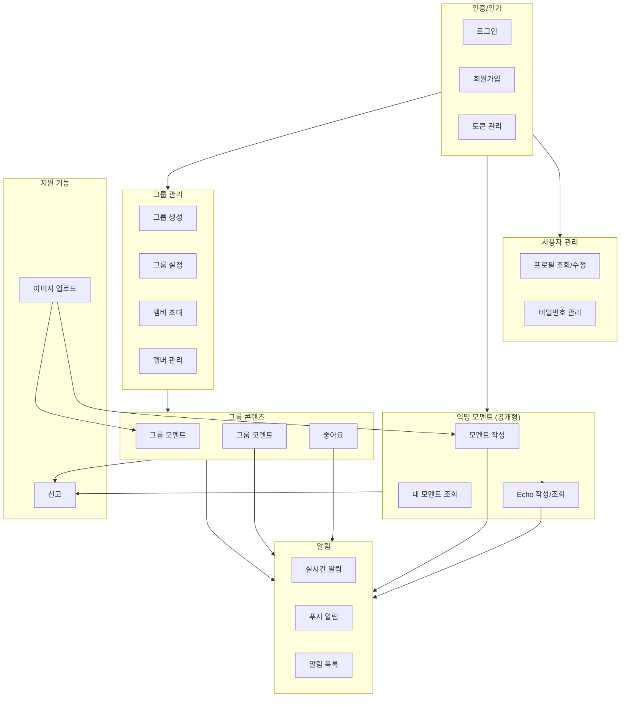

# Moment 프로젝트 클라이언트 기능 목록 및 사용자 요청 흐름

## 개요

Moment 프로젝트의 API를 분석하여 클라이언트가 구현할 수 있는 기능 목록과 각 기능별 사용자 요청 흐름 다이어그램을 정리한 문서입니다.

---

## 1. 클라이언트 기능 목록 (카테고리별)

### 1.1 회원 관리 (Authentication & User Management)

| 기능명 | 설명 | API Endpoint |
|--------|------|--------------|
| 이메일 회원가입 | 이메일, 비밀번호, 닉네임으로 회원가입 | POST `/api/v2/users/signup` |
| 이메일 인증 요청 | 회원가입 전 이메일 인증 코드 요청 | POST `/api/v2/auth/email` |
| 이메일 인증 확인 | 이메일로 받은 인증 코드 검증 | POST `/api/v2/auth/email/verify` |
| 닉네임 중복 확인 | 닉네임 사용 가능 여부 확인 | POST `/api/v2/users/signup/nickname/check` |
| 랜덤 닉네임 생성 | 사용 가능한 랜덤 닉네임 추천 | GET `/api/v2/users/signup/nickname` |
| 이메일 로그인 | 이메일/비밀번호로 로그인 | POST `/api/v2/auth/login` |
| Google 로그인 | OAuth 2.0 소셜 로그인 | GET `/api/v2/auth/login/google` |
| 로그아웃 | 세션 종료 및 토큰 삭제 | POST `/api/v2/auth/logout` |
| 로그인 상태 확인 | 현재 로그인 여부 확인 | GET `/api/v2/auth/login/check` |
| 토큰 재발급 | Access Token 갱신 | POST `/api/v2/auth/refresh` |
| 비밀번호 찾기 요청 | 이메일로 비밀번호 재설정 링크 전송 | POST `/api/v2/auth/email/password` |
| 비밀번호 재설정 | 이메일 링크 통해 비밀번호 변경 | POST `/api/v2/auth/email/password/reset` |

### 1.2 프로필 관리 (Profile Management)

| 기능명 | 설명 | API Endpoint |
|--------|------|--------------|
| 프로필 조회 | 내 프로필 정보 조회 | GET `/api/v2/users/me` |
| 마이페이지 프로필 조회 | 상세 프로필 정보 (레벨, 포인트 포함) | GET `/api/v2/me/profile` |
| 닉네임 변경 | 닉네임 수정 | POST `/api/v2/me/nickname` |
| 비밀번호 변경 | 로그인 상태에서 비밀번호 변경 | POST `/api/v2/me/password` |

### 1.3 모멘트 관리 (Moment Management - 익명 공개형)

| 기능명 | 설명 | API Endpoint |
|--------|------|--------------|
| 기본 모멘트 작성 | 하루 1회 무료 모멘트 작성 | POST `/api/v2/moments` |
| 추가 모멘트 작성 | 포인트 소모하여 추가 작성 | POST `/api/v2/moments/extra` |
| 내 모멘트 목록 조회 | 내가 작성한 모멘트 조회 (페이징) | GET `/api/v2/moments/me` |
| 알림 미확인 모멘트 조회 | 새 Echo가 있는 모멘트만 조회 | GET `/api/v2/moments/me/unread` |
| 기본 모멘트 작성 가능 여부 | 오늘 기본 모멘트 작성 가능 확인 | GET `/api/v2/moments/writable/basic` |
| 추가 모멘트 작성 가능 여부 | 포인트 충분 여부 확인 | GET `/api/v2/moments/writable/extra` |
| Echo 가능 모멘트 조회 | 내가 Echo를 달 수 있는 모멘트 조회 | GET `/api/v2/moments/commentable` |

### 1.4 Echo(코멘트) 관리 (Comment/Echo Management)

| 기능명 | 설명 | API Endpoint |
|--------|------|--------------|
| Echo 작성 | 타인의 모멘트에 Echo 작성 | POST `/api/v2/comments` |
| 내 Echo 목록 조회 | 내가 작성한 Echo 조회 (페이징) | GET `/api/v2/comments/me` |
| 알림 미확인 Echo 조회 | 새 알림이 있는 내 Echo 조회 | GET `/api/v2/comments/me/unread` |

### 1.5 그룹 관리 (Group Management)

| 기능명 | 설명 | API Endpoint |
|--------|------|--------------|
| 그룹 생성 | 새 그룹 만들기 | POST `/api/v2/groups` |
| 내 그룹 목록 조회 | 내가 속한 그룹 목록 | GET `/api/v2/groups` |
| 그룹 상세 조회 | 그룹 정보 상세 보기 | GET `/api/v2/groups/{groupId}` |
| 그룹 정보 수정 | 그룹명, 설명 수정 (소유자만) | PATCH `/api/v2/groups/{groupId}` |
| 그룹 삭제 | 그룹 삭제 (소유자만, 멤버 없을 때) | DELETE `/api/v2/groups/{groupId}` |
| 초대 링크 생성 | 그룹 초대 코드 생성 (소유자만) | POST `/api/v2/groups/{groupId}/invite` |
| 초대 정보 조회 | 초대 코드로 그룹 정보 확인 | GET `/api/v2/invite/{code}` |
| 그룹 가입 신청 | 초대 코드로 가입 신청 | POST `/api/v2/groups/join` |

### 1.6 그룹 멤버 관리 (Group Member Management)

| 기능명 | 설명 | API Endpoint |
|--------|------|--------------|
| 멤버 목록 조회 | 승인된 멤버 목록 | GET `/api/v2/groups/{groupId}/members` |
| 가입 대기자 목록 조회 | 승인 대기 멤버 목록 (소유자만) | GET `/api/v2/groups/{groupId}/pending` |
| 그룹 내 프로필 수정 | 그룹 내 닉네임 변경 | PATCH `/api/v2/groups/{groupId}/profile` |
| 그룹 탈퇴 | 그룹에서 탈퇴 | DELETE `/api/v2/groups/{groupId}/leave` |
| 멤버 강퇴 | 멤버 강제 탈퇴 (소유자만) | DELETE `/api/v2/groups/{groupId}/members/{memberId}` |
| 멤버 승인 | 가입 신청 승인 (소유자만) | POST `/api/v2/groups/{groupId}/members/{memberId}/approve` |
| 멤버 거절 | 가입 신청 거절 (소유자만) | POST `/api/v2/groups/{groupId}/members/{memberId}/reject` |
| 소유권 이전 | 그룹 소유권 다른 멤버에게 이전 | POST `/api/v2/groups/{groupId}/transfer/{memberId}` |

### 1.7 그룹 모멘트 관리 (Group Moment Management)

| 기능명 | 설명 | API Endpoint |
|--------|------|--------------|
| 그룹 모멘트 작성 | 그룹 내 모멘트 작성 | POST `/api/v2/groups/{groupId}/moments` |
| 그룹 피드 조회 | 그룹 전체 모멘트 피드 | GET `/api/v2/groups/{groupId}/moments` |
| 그룹 내 내 모멘트 조회 | 그룹에서 내가 작성한 모멘트 | GET `/api/v2/groups/{groupId}/my-moments` |
| 그룹 모멘트 삭제 | 내가 작성한 모멘트 삭제 | DELETE `/api/v2/groups/{groupId}/moments/{momentId}` |
| 모멘트 좋아요 토글 | 모멘트에 좋아요 추가/취소 | POST `/api/v2/groups/{groupId}/moments/{momentId}/like` |

### 1.8 그룹 코멘트 관리 (Group Comment Management)

| 기능명 | 설명 | API Endpoint |
|--------|------|--------------|
| 그룹 코멘트 작성 | 그룹 모멘트에 코멘트 작성 | POST `/api/v2/groups/{groupId}/moments/{momentId}/comments` |
| 그룹 코멘트 목록 조회 | 모멘트의 코멘트 목록 | GET `/api/v2/groups/{groupId}/moments/{momentId}/comments` |
| 그룹 코멘트 삭제 | 내가 작성한 코멘트 삭제 | DELETE `/api/v2/groups/{groupId}/comments/{commentId}` |
| 코멘트 좋아요 토글 | 코멘트에 좋아요 추가/취소 | POST `/api/v2/groups/{groupId}/comments/{commentId}/like` |

### 1.9 알림 관리 (Notification Management)

| 기능명 | 설명 | API Endpoint |
|--------|------|--------------|
| 실시간 알림 구독 | SSE로 실시간 알림 수신 | GET `/api/v2/notifications/subscribe` |
| 알림 목록 조회 | 알림 목록 조회 | GET `/api/v2/notifications` |
| 알림 읽음 처리 | 개별 알림 읽음 표시 | PATCH `/api/v2/notifications/{id}/read` |
| 모든 알림 읽음 처리 | 전체 알림 일괄 읽음 처리 | PATCH `/api/v2/notifications/read-all` |
| 디바이스 등록 | 푸시 알림용 디바이스 등록 | POST `/api/v2/push-notifications` |
| 디바이스 삭제 | 푸시 알림용 디바이스 제거 | DELETE `/api/v2/push-notifications` |

### 1.10 신고 관리 (Report Management)

| 기능명 | 설명 | API Endpoint |
|--------|------|--------------|
| 모멘트 신고 | 부적절한 모멘트 신고 | POST `/api/v2/moments/{id}/reports` |
| 코멘트 신고 | 부적절한 코멘트 신고 | POST `/api/v2/comments/{id}/reports` |

### 1.11 파일 업로드 (File Storage)

| 기능명 | 설명 | API Endpoint |
|--------|------|--------------|
| 이미지 업로드 URL 생성 | S3 Pre-signed URL 발급 | POST `/api/v2/storage/upload-url` |

---

## 2. 주요 기능별 Mermaid Sequence Diagram

### 2.1 회원가입 흐름

### 2.2 로그인 흐름

### 2.3 익명 모멘트 작성 및 Echo 흐름

### 2.4 그룹 생성 및 초대 흐름

### 2.5 그룹 모멘트 및 좋아요/코멘트 흐름

### 2.6 실시간 알림 흐름

### 2.7 이미지 업로드 흐름

### 2.8 비밀번호 재설정 흐름

### 2.9 신고 흐름

---

## 3. 기능 간 연관 관계 개요

---

## 4. 요약

### 클라이언트 구현 필수 기능 (총 11개 카테고리, 50+ 기능)

| 카테고리 | 기능 수 | 핵심 기능 |
|----------|---------|-----------|
| 회원 관리 | 12 | 이메일/Google 로그인, 토큰 자동 재발급 |
| 프로필 관리 | 4 | 마이페이지, 닉네임/비밀번호 변경 |
| 익명 모멘트 | 7 | 하루 1회 무료 작성, Echo 주고받기 |
| Echo 관리 | 3 | 타인 모멘트에 Echo 작성 |
| 그룹 관리 | 8 | 그룹 CRUD, 초대 링크 |
| 그룹 멤버 | 8 | 멤버 초대/승인/관리 |
| 그룹 모멘트 | 5 | 그룹 피드, 좋아요 |
| 그룹 코멘트 | 4 | 그룹 모멘트 코멘트 |
| 알림 | 6 | SSE 실시간, 푸시 알림 |
| 신고 | 2 | 부적절 콘텐츠 신고 |
| 파일 업로드 | 1 | S3 Pre-signed URL |

### 핵심 UX 흐름

1. **온보딩**: 이메일 인증 → 닉네임 설정 → 회원가입 완료
2. **일일 루틴**: 기본 모멘트 작성 → 타인 모멘트에 Echo → 내 모멘트에 받은 Echo 확인
3. **그룹 활동**: 그룹 가입 → 피드 탐색 → 모멘트/코멘트/좋아요 상호작용
4. **알림 체크**: SSE 실시간 수신 → 알림 확인 → 해당 모멘트로 이동

---

## 5. 참고 파일 경로

- `server/src/main/java/moment/auth/presentation/AuthController.java` - 인증 API
- `server/src/main/java/moment/moment/presentation/MomentController.java` - 모멘트 API
- `server/src/main/java/moment/group/presentation/GroupController.java` - 그룹 API
- `server/src/main/java/moment/notification/presentation/NotificationController.java` - 알림 API