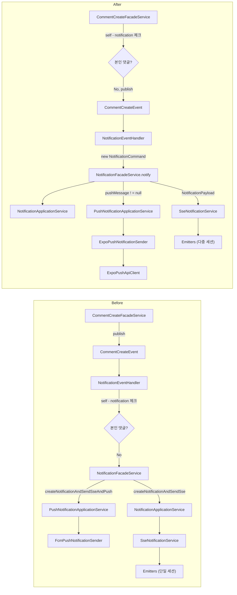
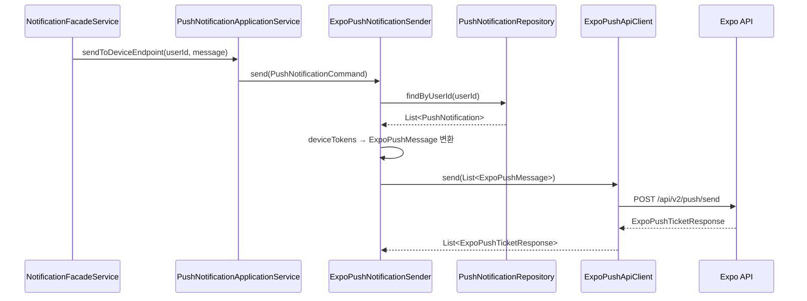

# 알림 시스템 전면 리팩토링 - FCM→Expo Push 마이그레이션 및 아키텍처 개선

> **브랜치**: `refactor/#1055`
> **기간**: 2026-02-04 ~ 2026-02-04
> **커밋 수**: 7개 (보고서 관련 커밋 제외 시 6개)
> **변경 유형**: mixed (feat + refactor)

## 개요

알림(notification) 모듈의 Push 인프라를 FCM(Firebase Cloud Messaging)에서 Expo Push로 마이그레이션하고, SSE 다중 세션 지원을 추가했다. 동시에 서비스 레이어를
`NotificationCommand` VO 기반으로 통일하고, `NotificationPayload` VO를 도입하여 알림 페이로드를 일원화했으며, 이벤트 핸들러에서 self-notification 방지 로직을
제거하고 이벤트 발행 측(Facade)으로 이동시켜 일원화했다.

## 커밋 히스토리

| 해시         | 메시지                                             | 날짜         |
|------------|-------------------------------------------------|------------|
| `8a3f6fc6` | refactor: notification 모듈 dead code 정리 및 구조 개선  | 2026-02-04 |
| `0a9f25df` | feat: SSE 다중 세션 지원                              | 2026-02-04 |
| `f1c51a72` | feat: FCM에서 Expo Push로 인프라 마이그레이션               | 2026-02-04 |
| `21a999f7` | refactor: 알림 페이로드 통일 (NotificationPayload VO)   | 2026-02-04 |
| `22e0287c` | refactor: NotificationCommand 도입 및 서비스 레이어 리팩토링 | 2026-02-04 |
| `b477ed83` | refactor: 이벤트 시스템 개선 - self-notification 방지 일원화 | 2026-02-04 |

## 변경 파일 요약

### 신규 파일

| 파일                                                                                        | 핵심 내용                                     |
|-------------------------------------------------------------------------------------------|-------------------------------------------|
| `src/main/java/moment/notification/domain/NotificationCommand.java:1`                     | 알림 생성 명령 VO (6개 파라미터 → 1개 record)         |
| `src/main/java/moment/notification/domain/NotificationPayload.java:1`                     | SSE 응답용 알림 페이로드 VO (딥링크 생성 포함)            |
| `src/main/java/moment/notification/infrastructure/expo/ExpoPushApiClient.java:1`          | Expo Push API HTTP 클라이언트 (재시도 로직 포함)      |
| `src/main/java/moment/notification/infrastructure/expo/ExpoPushNotificationSender.java:1` | PushNotificationSender 인터페이스 Expo 구현체     |
| `src/main/java/moment/notification/infrastructure/expo/ExpoPushMessage.java:1`            | Expo Push 메시지 DTO                         |
| `src/main/java/moment/notification/infrastructure/expo/ExpoPushApiException.java:1`       | Expo API 전용 예외                            |
| `src/main/java/moment/notification/infrastructure/expo/ExpoPushTicketResponse.java:1`     | Expo 티켓 응답 DTO                            |
| `src/main/java/moment/notification/infrastructure/expo/ExpoPushReceipt.java:1`            | Expo 수신 확인 DTO                            |
| `src/main/java/moment/comment/service/facade/GroupCommentCreateFacadeService.java:1`      | 그룹 댓글 생성 Facade (self-notification 방지 포함) |

### 삭제 파일

| 파일                                                                                | 사유                |
|-----------------------------------------------------------------------------------|-------------------|
| `src/main/java/moment/global/config/FcmConfig.java`                               | FCM 제거로 불필요       |
| `src/main/java/moment/notification/infrastructure/FcmPushNotificationSender.java` | Expo로 교체          |
| `src/main/java/moment/notification/service/EmailNotificationService.java`         | 사용되지 않는 dead code |
| `src/main/java/moment/comment/dto/EchoCreateEvent.java`                           | 사용되지 않는 dead code |

### 수정 파일

| 파일                                                                                        | 핵심 변경 내용                                                      |
|-------------------------------------------------------------------------------------------|---------------------------------------------------------------|
| `src/main/java/moment/notification/service/facade/NotificationFacadeService.java:21`      | `notify(NotificationCommand)` 단일 메서드로 통합                      |
| `src/main/java/moment/notification/service/eventHandler/NotificationEventHandler.java:35` | NotificationCommand 기반으로 전환, self-notification 방지 제거          |
| `src/main/java/moment/notification/infrastructure/Emitters.java:17`                       | `Map<Long, SseEmitter>` → `Map<Long, List<SseEmitter>>` 다중 세션 |
| `src/main/java/moment/notification/dto/response/NotificationSseResponse.java:36`          | `NotificationPayload` 기반 `of()` 팩토리로 변경                       |
| `src/main/java/moment/notification/domain/PushNotificationMessage.java:24`                | `from(NotificationType)` 역변환 메서드 추가                           |
| `src/main/java/moment/notification/domain/NotificationType.java:7`                        | `NEW_REPLY_ON_COMMENT` 제거                                     |
| `src/main/java/moment/comment/dto/CommentCreateEvent.java:5`                              | `commenterId` 필드 추가 (self-notification 방지용)                   |
| `src/main/java/moment/comment/service/facade/CommentCreateFacadeService.java:31`          | self-notification 방지 로직 추가                                    |
| `build.gradle:40`                                                                         | `firebase-admin` 의존성 제거                                       |
| `src/main/resources/application-dev.yml`                                                  | `fcm` → `expo.push` 설정 변경                                     |
| `src/main/resources/application-prod.yml`                                                 | `fcm` → `expo.push` 설정 변경                                     |

## 상세 변경 내용

### Phase 1: Dead Code 정리

FCM 마이그레이션 전 사용되지 않는 코드를 선제적으로 정리했다.

- `EmailNotificationService` (134줄): 어디에서도 참조되지 않는 이메일 알림 서비스 삭제
- `EchoCreateEvent`: 사용되지 않는 이벤트 record 삭제
- `NotificationType.NEW_REPLY_ON_COMMENT`: 어디에서도 사용되지 않는 enum 값 제거

### Phase 2: SSE 다중 세션 지원

한 유저가 여러 디바이스/탭에서 동시에 SSE 연결을 유지할 수 있도록 `Emitters`를 변경했다.

**Before** (`src/main/java/moment/notification/infrastructure/Emitters.java:14`)

```java
private final Map<Long, SseEmitter> emitters = new ConcurrentHashMap<>();

public SseEmitter add(Long userId, SseEmitter emitter) {
    emitters.put(userId, emitter);  // 기존 연결 덮어쓰기
    emitter.onError(e -> emitters.remove(userId));
    ...
}
```

**After** (`src/main/java/moment/notification/infrastructure/Emitters.java:17`)

```java
private final Map<Long, List<SseEmitter>> emitters = new ConcurrentHashMap<>();

public SseEmitter add(Long userId, SseEmitter emitter) {
    emitters.computeIfAbsent(userId, k -> new CopyOnWriteArrayList<>()).add(emitter);
    emitter.onError(e -> removeEmitter(userId, emitter));
    ...
}
```

`sendToClient`와 `sendHeartbeat`도 리스트 순회 + dead emitter 정리 방식으로 변경되었다.

### Phase 3: FCM → Expo Push 마이그레이션

FCM 인프라를 완전히 제거하고 Expo Push로 교체했다.

**삭제된 컴포넌트:**

- `FcmConfig.java` - Firebase 초기화 설정 (서비스 계정 JSON 파싱)
- `FcmPushNotificationSender.java` - FCM API 호출 구현체
- `firebase-admin` Gradle 의존성

**신규 Expo 인프라:**

`ExpoPushApiClient.java:28` - Expo Push API와 HTTP 통신을 담당. `RestClient` 기반이며, 429(Rate Limit) 및 5xx 에러에 대한 지수 백오프 재시도 로직(
최대 3회)을 포함한다.

`ExpoPushNotificationSender.java:16` - `PushNotificationSender` 인터페이스의 Expo 구현체. 유저의 디바이스 토큰을 조회하여 Expo 메시지로 변환 후 전송한다.

**설정 변경:**

```yaml
# Before
fcm:
  service-account-json: ${FCM_CREDENTIALS}

# After
expo:
  push:
    enabled: true
```

### Phase 4: NotificationPayload VO 도입

알림 SSE 응답 생성 로직이 여러 곳에 흩어져 있던 것을 `NotificationPayload` VO로 통일했다.

**Before** (`src/main/java/moment/notification/dto/response/NotificationSseResponse.java`)

```java
public static NotificationSseResponse createSseResponse(
        Long notificationId, NotificationType type,
        TargetType targetType, Long targetId, Long groupId) {
    return new NotificationSseResponse(notificationId, type, targetType,
            targetId, groupId, type.getMessage(), false, null);  // link가 null
}
```

**After** (`src/main/java/moment/notification/domain/NotificationPayload.java:14`)

```java
public static NotificationPayload from(Notification notification) {
    return new NotificationPayload(
            notification.getId(), notification.getNotificationType(),
            notification.getTargetType(), notification.getTargetId(),
            notification.getGroupId(), notification.getNotificationType().getMessage(),
            buildLink(notification.getTargetType(), notification.getTargetId(),
                    notification.getGroupId()));
}
```

딥링크(`/moments/{id}`, `/comments/{id}`, `/groups/{id}`) 생성 로직이 `NotificationPayload.buildLink()`에 집중되었다.

### Phase 5: NotificationCommand 도입 및 서비스 레이어 리팩토링

`NotificationFacadeService`의 6개 파라미터를 `NotificationCommand` record로 통합했다.

**Before** (`src/main/java/moment/notification/service/facade/NotificationFacadeService.java`)

```java
public void createNotificationAndSendSseAndPush(
        Long userId, Long targetId,
        NotificationType notificationType, TargetType targetType,
        Long groupId, PushNotificationMessage message) {
    createNotificationAndSendSse(userId, targetId, notificationType, targetType, groupId);
    pushNotificationApplicationService.sendToDeviceEndpoint(userId, message);
}
```

**After** (`src/main/java/moment/notification/service/facade/NotificationFacadeService.java:21`)

```java
public void notify(NotificationCommand command) {
    Notification savedNotification = notificationApplicationService.createNotification(
            command.userId(), command.targetId(), command.notificationType(),
            command.targetType(), command.groupId());
    NotificationPayload payload = NotificationPayload.from(savedNotification);
    sseNotificationService.sendToClient(command.userId(), "notification",
            NotificationSseResponse.of(payload));
    if (command.pushMessage() != null) {
        pushNotificationApplicationService.sendToDeviceEndpoint(
                command.userId(), command.pushMessage());
    }
}
```

기존 `createNotificationAndSendSse()` + `createNotificationAndSendSseAndPush()` 2개 메서드가 `notify()` 1개로 통합되었다. Push가 불필요한
경우 `pushMessage`를 `null`로 전달한다.

### Phase 6: Self-Notification 방지 일원화

기존에는 `NotificationEventHandler`에서 self-notification을 방지했지만, 이를 이벤트 발행 측(Facade)으로 이동시켰다.

**Before** - EventHandler에서 방지:

```java
// NotificationEventHandler에서
public void handleCommentCreateEvent(CommentCreateEvent event) {
    // self-notification 체크가 여기에 있었음 (일부 핸들러에만 존재)
    notificationFacadeService.createNotificationAndSendSseAndPush(...)
}
```

**After** - Facade에서 발행 전 차단:

`src/main/java/moment/comment/service/facade/CommentCreateFacadeService.java:31`

```java
if(!moment.getMomenterId().

equals(userId)){
        publisher.

publishEvent(CommentCreateEvent.of(moment, userId));
        }
```

`src/main/java/moment/comment/service/facade/GroupCommentCreateFacadeService.java:30`

```java
if(!moment.getMomenterId().

equals(userId)){
        publisher.

publishEvent(new GroupCommentCreateEvent(...));
        }
```

`CommentCreateEvent`에 `commenterId` 필드가 추가되었고, Facade에서 `momenterId != userId` 비교 후에만 이벤트를 발행한다. EventHandler는 수신된 이벤트를
그대로 처리하면 된다.

## 아키텍처 다이어그램

### 리팩토링 전후 알림 흐름 비교



### Expo Push 전송 흐름 (신규)



## 영향 범위 분석

### 직접 영향

| 모듈           | 영향받는 파일                                       | 영향 내용                                                         |
|--------------|-----------------------------------------------|---------------------------------------------------------------|
| comment      | `CommentCreateFacadeService.java:31`          | self-notification 방지 로직 추가, `CommentCreateEvent.of()` 시그니처 변경 |
| comment      | `GroupCommentCreateFacadeService.java:30`     | 신규 Facade 추출, self-notification 방지                            |
| group        | `GroupCommentController.java:4`               | GroupCommentCreateFacadeService 주입 변경                         |
| notification | `NotificationEventHandler.java:35`            | NotificationCommand 기반 호출로 전환                                 |
| notification | `NotificationFacadeService.java:21`           | `notify()` 단일 진입점으로 통합                                        |
| notification | `Emitters.java:17`                            | 다중 세션 구조 변경                                                   |
| global       | `FcmConfig.java`                              | 삭제 (Firebase 의존성 완전 제거)                                       |
| build        | `build.gradle:40`                             | `firebase-admin` 의존성 제거                                       |
| config       | `application-dev.yml`, `application-prod.yml` | `fcm` → `expo.push` 설정 키 변경                                   |

### 간접 영향

- **클라이언트**: Push 토큰 등록 시 FCM 토큰 대신 Expo Push Token을 전달해야 함. `DeviceEndpointRequest`의 `expoPushToken` 필드명 변경 확인 필요
- **SSE 클라이언트**: 응답 필드에 `link`(딥링크)가 추가되어 기존에 `null`이었던 값이 채워짐. 클라이언트에서 딥링크 처리 로직 필요
- **인프라**: Firebase 서비스 계정 JSON 환경변수(`FCM_CREDENTIALS`) 불필요, Expo Push는 별도 인증 없이 동작
- **CI/CD**: Firebase 관련 시크릿 제거 가능

## 테스트 현황

### 신규 테스트

| 테스트 파일                                                                                        | 검증 내용                                             |
|-----------------------------------------------------------------------------------------------|---------------------------------------------------|
| `src/test/java/moment/notification/domain/NotificationPayloadTest.java:1`                     | NotificationPayload 생성 및 딥링크 빌드 검증                |
| `src/test/java/moment/notification/domain/PushNotificationMessageTest.java:1`                 | NotificationType → PushNotificationMessage 역변환 검증 |
| `src/test/java/moment/notification/infrastructure/expo/ExpoPushNotificationSenderTest.java:1` | Expo Push 전송 로직 단위 테스트                            |
| `src/test/java/moment/comment/service/facade/GroupCommentCreateFacadeServiceTest.java:1`      | 그룹 댓글 Facade + self-notification 방지 검증            |

### 수정된 테스트

| 테스트 파일                                                                                            | 변경 내용                             |
|---------------------------------------------------------------------------------------------------|-----------------------------------|
| `src/test/java/moment/notification/infrastructure/EmittersTest.java:1`                            | 다중 세션 시나리오 테스트 추가                 |
| `src/test/java/moment/notification/service/eventHandler/NotificationEventHandlerTest.java:1`      | NotificationCommand 기반으로 검증 로직 변경 |
| `src/test/java/moment/notification/service/facade/NotificationFacadeServiceTest.java:1`           | `notify()` 메서드 기반으로 변경            |
| `src/test/java/moment/notification/service/application/NotificationApplicationServiceTest.java:1` | 시그니처 변경 반영                        |
| `src/test/java/moment/notification/service/notification/NotificationServiceTest.java:1`           | 시그니처 변경 반영                        |
| `src/test/java/moment/notification/infrastructure/NotificationRepositoryTest.java:1`              | 리포지토리 변경 반영                       |
| `src/test/java/moment/notification/domain/NotificationTest.java:1`                                | 도메인 변경 반영                         |

### 테스트 커버리지

- 변경된 프로덕션 코드 중 테스트가 존재하는 파일: **14/14** (삭제 파일 제외)
- 삭제된 테스트: `FcmPushNotificationSenderTest.java` (FCM 제거로 불필요)
- `ExpoPushApiClient.java`에 대한 단위 테스트는 `ExpoPushNotificationSenderTest`에서 mock으로 간접 검증

## 잠재적 이슈

- **ExpoPushApiClient 스레드 블로킹**: `Thread.sleep()` 기반 재시도 로직이 `@Async` 스레드풀의 스레드를 블로킹할 수 있다. 높은 트래픽 시 스레드풀 고갈 가능성이 있으며,
  향후 비동기 재시도(Spring Retry, Resilience4j 등)로 전환을 고려할 수 있다 (`ExpoPushApiClient.java:110`)
- **Emitters CopyOnWriteArrayList 성능**: `CopyOnWriteArrayList`는 쓰기 시 전체 배열을 복사한다. 한 유저의 동시 세션 수가 많아지면 `add`/`remove` 성능이
  저하될 수 있으나, 일반적인 사용 패턴(유저당 1~3세션)에서는 문제 없다 (`Emitters.java:20`)
- **Dead Emitter 누적**: `sendToClient`에서 dead emitter를 정리하지만, 전송이 없는 유저의 끊어진 연결은 `sendHeartbeat` 주기까지 남아있게 된다. heartbeat
  주기가 적절한지 확인 필요
- **NotificationPayload.buildLink 하드코딩**: 딥링크 경로(`/moments/`, `/comments/`, `/groups/`)가 하드코딩되어 있다. 클라이언트 라우팅 변경 시 서버
  코드도 수정해야 한다 (`NotificationPayload.java:28`)
