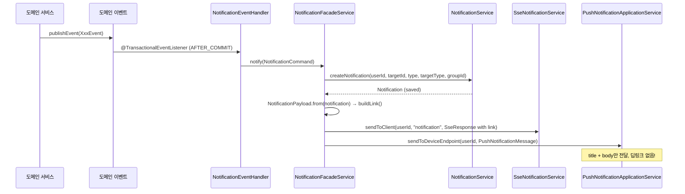
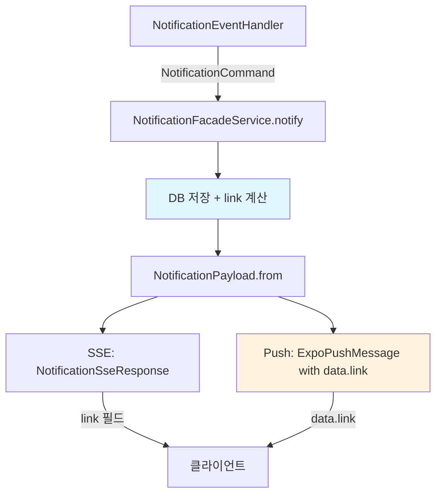
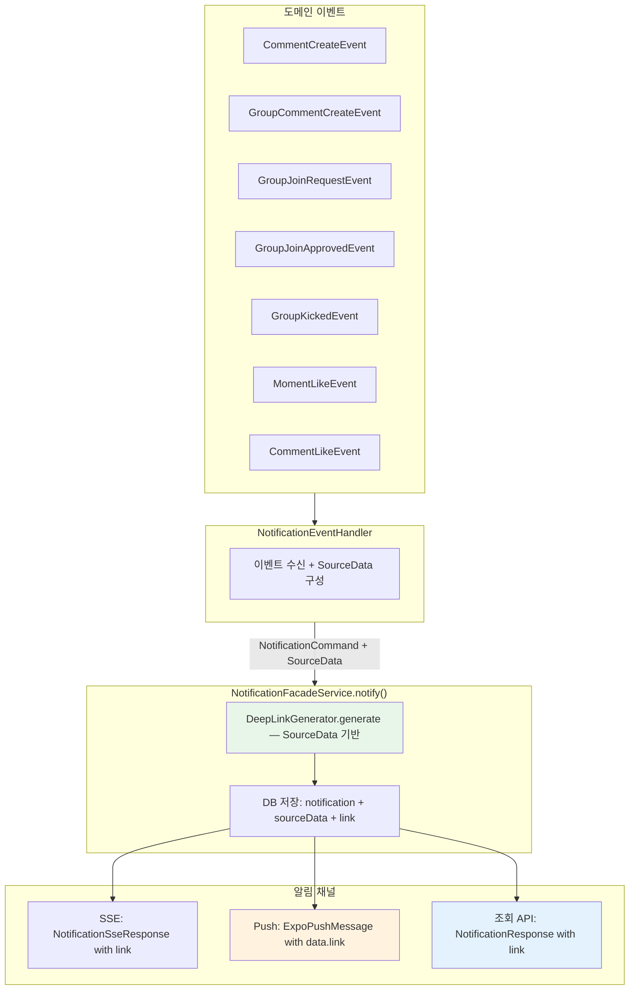

# 알림 시스템 리팩토링 스펙: JSON 소스 컬럼 + 딥링크 통합

> Last Updated: 2026-02-06
> Branch: refactor/#1068
> Flyway 다음 버전: V36

---

## 1. 개요

### 1.1 목적
알림(Notification) 시스템의 데이터 구조를 전면 개편하여:
1. 기존 `target_type` + `target_id` + `group_id` 컬럼을 **삭제**하고, 알림 소스 정보를 `source_data` JSON으로 유연하게 저장
2. **Push 알림에 딥링크**를 추가하여 SSE/Push/조회 API 모두 동일한 딥링크 제공
3. 향후 새로운 알림 타입 추가 시 DB 스키마 변경 없이 확장 가능
4. 기존 알림 데이터를 **전량 삭제**하여 깨끗하게 시작 (하위 호환 불필요)

### 1.2 배경
- 현재 `target_type` + `target_id` + `group_id`의 조합으로 알림 소스를 판단하지만, 이 구조는 새로운 알림 타입 추가 시 컬럼 추가가 필요할 수 있음
- SSE는 `NotificationPayload.buildLink()`로 딥링크를 생성하지만, Push 알림은 `title` + `body`만 전달하여 딥링크 없음
- 알림 조회 API(`NotificationResponse`)도 딥링크를 포함하지 않음
- **하위 호환을 유지할 필요 없음**: 기존 알림 데이터를 전량 삭제하고 새 구조로 전환

### 1.3 범위
- `notifications` 테이블 스키마 변경 (기존 컬럼 삭제 + JSON 컬럼 추가)
- `Notification` 엔티티에서 `targetType`, `targetId`, `groupId` 제거
- notification 도메인 내 `TargetType` 참조 전면 제거
- Push 알림 딥링크 데이터 추가
- 알림 조회 API 딥링크 포함
- 기존 데이터 전량 삭제 (마이그레이션 간소화)
- 필드명 `deepLink` → `link` 통일

---

## 2. 현재 상태 (AS-IS)

### 2.1 DB 스키마

```sql
notifications (
    id              BIGINT AUTO_INCREMENT PK,
    user_id         BIGINT NOT NULL FK -> users(id),
    notification_type VARCHAR(255) NOT NULL,   -- enum: NotificationType
    target_type     VARCHAR(255) NOT NULL,     -- enum: TargetType
    target_id       BIGINT NOT NULL,
    is_read         BOOLEAN NOT NULL,
    group_id        BIGINT DEFAULT NULL,       -- V33에서 추가
    created_at      TIMESTAMP NOT NULL,
    deleted_at      TIMESTAMP DEFAULT NULL     -- V10에서 추가
)
```

### 2.2 알림 생성 흐름



### 2.3 딥링크 현황

| 채널 | 딥링크 제공 | 생성 위치 |
|------|------------|----------|
| SSE (실시간) | O | `NotificationPayload.buildLink()` |
| Push (앱 푸시) | X | N/A |
| 알림 조회 API | X | N/A |

**현재 딥링크 생성 로직** (`NotificationPayload.buildLink`):
```java
private static String buildLink(TargetType targetType, Long targetId, Long groupId) {
    return switch (targetType) {
        case MOMENT -> "/moments/" + targetId;
        case COMMENT -> "/comments/" + targetId;
        case GROUP, GROUP_MEMBER -> "/groups/" + (groupId != null ? groupId : targetId);
    };
}
```

### 2.4 문제점

1. **확장성 부족**: 새로운 알림 타입 추가 시 `target_type`, `target_id`, `group_id` 조합만으로는 필요한 컨텍스트 정보를 다 담지 못함
2. **딥링크 불일치**: SSE는 딥링크 제공, Push/조회 API는 미제공
3. **딥링크 로직 분산**: `NotificationPayload`에서만 딥링크를 생성하여, Push나 조회 시 활용 불가
4. **TargetType 의존성**: notification 도메인이 `TargetType`에 불필요하게 의존. `notification_type`만으로 충분히 라우팅 가능
5. **좋아요 알림에 groupId 미전달**: `MomentLikeEvent`/`CommentLikeEvent` 핸들러에서 groupId를 null로 전달
6. **NotificationPayload 레이어 위치 부적절**: 도메인 패키지에 있지만 실질적으로 DTO 역할 + 딥링크 생성 로직을 포함하여 책임 혼재

> **참고**: 읽음 처리 API (`PATCH /{id}/read`, `PATCH /read-all`)에 `@AuthenticationPrincipal` 인증이 없는 보안 이슈가 존재하지만, 본 스펙의 범위 밖이므로 별도 이슈로 추적 권장

---

## 3. 목표 상태 (TO-BE)

### 3.1 DB 스키마 변경

```sql
notifications (
    id                BIGINT AUTO_INCREMENT PK,
    user_id           BIGINT NOT NULL FK -> users(id),
    notification_type VARCHAR(255) NOT NULL,
    is_read           BOOLEAN NOT NULL,
    source_data       JSON DEFAULT NULL,           -- ★ 신규: 소스 컨텐츠 JSON (ID만 저장)
    link              VARCHAR(512) DEFAULT NULL,   -- ★ 신규: 생성 시점에 딥링크 저장
    created_at        TIMESTAMP NOT NULL,
    deleted_at        TIMESTAMP DEFAULT NULL
)
```

**변경 포인트**:
- `target_type`, `target_id`, `group_id` 컬럼 **삭제** (하위 호환 제거)
- `source_data` (JSON): 알림 발생 소스의 **ID 값만** 저장 (닉네임 등 부가 정보 제외)
- `link` (VARCHAR): 알림 생성 시 딥링크를 계산하여 저장 (조회 시 재계산 불필요)

### 3.2 JSON 스키마 설계 (NotificationType별)

각 알림 타입별 `source_data` JSON 구조 — **ID 값만 저장**:

#### NEW_COMMENT_ON_MOMENT (개인 모멘트 댓글)
```json
{"momentId": 42}
```

#### NEW_COMMENT_ON_MOMENT (그룹 모멘트 댓글)
```json
{"momentId": 42, "groupId": 3}
```

#### GROUP_JOIN_REQUEST
```json
{"groupId": 3}
```

#### GROUP_JOIN_APPROVED
```json
{"groupId": 3}
```

#### GROUP_KICKED
```json
{"groupId": 3}
```

#### MOMENT_LIKED
```json
{"momentId": 42}
```

#### COMMENT_LIKED
```json
{"commentId": 15}
```

### 3.3 딥링크 생성 전략

**원칙**: 알림 생성 시점에 딥링크를 계산하여 `link` 컬럼에 저장 (Write-time Computation)

**장점**:
- 조회 시 재계산 불필요 (성능)
- SSE/Push/조회 API 모두 동일한 값 사용 (일관성)
- `source_data`의 정보로 필요시 딥링크 재생성 가능

**딥링크 패턴**:

| NotificationType | link |
|------------------|------|
| NEW_COMMENT_ON_MOMENT (개인) | `/moments/{momentId}` |
| NEW_COMMENT_ON_MOMENT (그룹) | `/groups/{groupId}/moments/{momentId}` |
| GROUP_JOIN_REQUEST | `/groups/{groupId}` |
| GROUP_JOIN_APPROVED | `/groups/{groupId}` |
| **GROUP_KICKED** | **null** (접근 불가 리소스) |
| MOMENT_LIKED | `/moments/{momentId}` |
| COMMENT_LIKED | `/comments/{commentId}` |

> **GROUP_KICKED가 null인 이유**: 강퇴된 사용자는 해당 그룹에 접근할 수 없으므로 딥링크를 제공하지 않음

### 3.4 Push 알림 딥링크 전달 방식

Expo Push Notification API의 `data` 필드를 활용:

```json
{
  "to": "ExponentPushToken[xxx]",
  "title": "Moment",
  "body": "당신의 모멘트에 누군가 코멘트를 달았어요:)",
  "data": {
    "link": "/moments/42"
  },
  "sound": "default"
}
```

> **필드명 통일**: Push data에서도 `"link"` 키 사용 (`deepLink` 아님)

**변경 흐름**:



---

## 4. 상세 설계

### 4.1 Flyway 마이그레이션

**V36__alter_notifications_remove_legacy_add_source_and_link.sql**:

```sql
-- 1. 기존 알림 데이터 전량 삭제
DELETE FROM notifications;

-- 2. 기존 컬럼 삭제
ALTER TABLE notifications DROP COLUMN target_type;
ALTER TABLE notifications DROP COLUMN target_id;
ALTER TABLE notifications DROP INDEX idx_notifications_group;
ALTER TABLE notifications DROP COLUMN group_id;

-- 3. 신규 컬럼 추가
ALTER TABLE notifications ADD COLUMN source_data JSON DEFAULT NULL;
ALTER TABLE notifications ADD COLUMN link VARCHAR(512) DEFAULT NULL;
```

> **기존 데이터 마이그레이션 불필요**: `DELETE FROM notifications` 한 줄로 간소화. 기존 UPDATE 문 전부 불필요.

### 4.2 엔티티 변경

**Notification.java** 변경:

```java
@Entity(name = "notifications")
@SQLDelete(sql = "UPDATE notifications SET deleted_at = NOW() WHERE id = ?")
@SQLRestriction("deleted_at IS NULL")
@NoArgsConstructor(access = AccessLevel.PROTECTED)
@Getter
public class Notification extends BaseEntity {

    @Id
    @GeneratedValue(strategy = GenerationType.IDENTITY)
    private Long id;

    @ManyToOne(fetch = FetchType.LAZY)
    @JoinColumn(name = "user_id")
    private User user;

    @Enumerated(EnumType.STRING)
    private NotificationType notificationType;

    private boolean isRead;

    @Column(name = "source_data", columnDefinition = "JSON")
    @Convert(converter = SourceDataConverter.class)
    private SourceData sourceData;

    @Column(name = "link", length = 512)
    private String link;

    private LocalDateTime deletedAt;

    public Notification(User user,
                        NotificationType notificationType,
                        SourceData sourceData,
                        String link) {
        this.user = user;
        this.notificationType = notificationType;
        this.sourceData = sourceData;
        this.link = link;
        this.isRead = false;
    }

    public void markAsRead() {
        isRead = true;
    }
}
```

**삭제된 필드**: `targetType` (TargetType), `targetId` (Long), `groupId` (Long)

### 4.3 NotificationCommand 변경

```java
public record NotificationCommand(
        Long userId,
        NotificationType notificationType,
        SourceData sourceData,
        PushNotificationMessage pushMessage
) {}
```

**삭제된 필드**: `targetId`, `targetType`, `groupId`

### 4.4 신규 도메인 클래스

**SourceData.java** (값 객체):

```java
package moment.notification.domain;

import java.util.Map;

public record SourceData(Map<String, Object> data) {

    public static SourceData of(Map<String, Object> data) {
        return new SourceData(data);
    }

    public static SourceData empty() {
        return new SourceData(Map.of());
    }

    public Object get(String key) {
        return data.get(key);
    }

    public Long getLong(String key) {
        Object value = data.get(key);
        if (value == null) return null;
        if (value instanceof Long l) return l;
        if (value instanceof Number n) return n.longValue();
        return Long.valueOf(value.toString());
    }
}
```

**SourceDataConverter.java** (JPA Converter):

```java
package moment.notification.infrastructure;

import com.fasterxml.jackson.core.JsonProcessingException;
import com.fasterxml.jackson.core.type.TypeReference;
import com.fasterxml.jackson.databind.ObjectMapper;
import jakarta.persistence.AttributeConverter;
import jakarta.persistence.Converter;
import java.util.Map;
import moment.notification.domain.SourceData;

@Converter
public class SourceDataConverter implements AttributeConverter<SourceData, String> {

    private static final ObjectMapper objectMapper = new ObjectMapper();

    @Override
    public String convertToDatabaseColumn(SourceData sourceData) {
        if (sourceData == null || sourceData.data() == null) {
            return null;
        }
        try {
            return objectMapper.writeValueAsString(sourceData.data());
        } catch (JsonProcessingException e) {
            throw new IllegalArgumentException("source_data JSON 변환 실패", e);
        }
    }

    @Override
    public SourceData convertToEntityAttribute(String json) {
        if (json == null || json.isBlank()) {
            return SourceData.empty();
        }
        try {
            Map<String, Object> data = objectMapper.readValue(json,
                    new TypeReference<Map<String, Object>>() {});
            return SourceData.of(data);
        } catch (JsonProcessingException e) {
            throw new IllegalArgumentException("source_data JSON 파싱 실패", e);
        }
    }
}
```

**DeepLinkGenerator.java** (딥링크 생성 전략 — SourceData 기반):

```java
package moment.notification.domain;

public class DeepLinkGenerator {

    public static String generate(NotificationType notificationType, SourceData sourceData) {
        return switch (notificationType) {
            case NEW_COMMENT_ON_MOMENT -> {
                Long groupId = sourceData.getLong("groupId");
                Long momentId = sourceData.getLong("momentId");
                yield (groupId != null)
                    ? "/groups/" + groupId + "/moments/" + momentId
                    : "/moments/" + momentId;
            }
            case GROUP_JOIN_REQUEST, GROUP_JOIN_APPROVED ->
                "/groups/" + sourceData.getLong("groupId");
            case GROUP_KICKED -> null;
            case MOMENT_LIKED ->
                "/moments/" + sourceData.getLong("momentId");
            case COMMENT_LIKED ->
                "/comments/" + sourceData.getLong("commentId");
        };
    }
}
```

### 4.5 TargetType 외부 의존성 처리 (핵심)

**기존 메서드** (TargetType 사용):
- `getUnreadNotifications(userId, TargetType)` → `findAllByUserIdAndIsReadAndTargetType`
- `getNotificationsByTargetIdsAndTargetType(ids, TargetType)` → `findNotificationsBy`

**변경 방식**: `notification_type` 기반 조회 + 서비스 레이어에서 `source_data`의 ID 추출 (MySQL JSON 쿼리 회피)

```java
// NotificationRepository - notification_type 기반 조회
List<Notification> findAllByUserIdAndIsReadAndNotificationTypeIn(
    Long userId, boolean isRead, List<NotificationType> types);

List<Notification> findAllByIsReadAndNotificationTypeIn(
    boolean isRead, List<NotificationType> types);
```

```java
// NotificationApplicationService - 서비스 레이어 필터링
private static final List<NotificationType> MOMENT_TYPES =
    List.of(NotificationType.NEW_COMMENT_ON_MOMENT, NotificationType.MOMENT_LIKED);

private static final List<NotificationType> COMMENT_TYPES =
    List.of(NotificationType.COMMENT_LIKED);

public List<Long> getUnreadMomentIds(Long userId) {
    List<Notification> notifications = notificationService.getAllBy(
        userId, false, MOMENT_TYPES);
    return notifications.stream()
        .map(n -> n.getSourceData().getLong("momentId"))
        .filter(Objects::nonNull)
        .distinct()
        .toList();
}

public List<Long> getUnreadCommentIds(Long userId) {
    List<Notification> notifications = notificationService.getAllBy(
        userId, false, COMMENT_TYPES);
    return notifications.stream()
        .map(n -> n.getSourceData().getLong("commentId"))
        .filter(Objects::nonNull)
        .distinct()
        .toList();
}
```

**호출부 변경**:
- `MyGroupMomentPageFacadeService`: `getUnreadNotifications(userId, MOMENT)` → `getUnreadMomentIds(userId)`
- `MyGroupCommentPageFacadeService`: `getUnreadNotifications(userId, COMMENT)` → `getUnreadCommentIds(userId)`
- 유사하게 `getNotificationsByTargetIdsAndTargetType` → `getNotificationsByMomentIds` / `getNotificationsByCommentIds`

### 4.6 NotificationFacadeService 변경

```java
@Service
@RequiredArgsConstructor
public class NotificationFacadeService {

    private final NotificationApplicationService notificationApplicationService;
    private final SseNotificationService sseNotificationService;
    private final PushNotificationApplicationService pushNotificationApplicationService;

    public void notify(NotificationCommand command) {
        // 1. 딥링크 계산 (SourceData 기반)
        String link = DeepLinkGenerator.generate(
                command.notificationType(), command.sourceData());

        // 2. DB 저장 (sourceData + link 포함)
        Notification savedNotification = notificationApplicationService.createNotification(
                command.userId(), command.notificationType(),
                command.sourceData(), link);

        // 3. SSE 전송 (link 포함)
        NotificationSseResponse sseResponse = NotificationSseResponse.from(savedNotification);
        sseNotificationService.sendToClient(command.userId(), "notification", sseResponse);

        // 4. Push 전송 (link 포함) ★ 변경
        if (command.pushMessage() != null) {
            pushNotificationApplicationService.sendToDeviceEndpoint(
                    command.userId(), command.pushMessage(), link);
        }
    }
}
```

### 4.7 Push 알림 딥링크 전달

**PushNotificationApplicationService 변경**:

```java
public void sendToDeviceEndpoint(long userId, PushNotificationMessage message, String link) {
    User user = userService.getUserBy(userId);
    pushNotificationSender.send(new PushNotificationCommand(user, message, link));
}
```

**PushNotificationCommand 변경**:

```java
public record PushNotificationCommand(
        User user,
        PushNotificationMessage message,
        String link               // ★ 신규 (deepLink → link)
) {}
```

**ExpoPushNotificationSender 변경**:

```java
@Override
public void send(PushNotificationCommand command) {
    Long userId = command.user().getId();
    PushNotificationMessage message = command.message();
    String link = command.link();

    List<String> deviceTokens = pushNotificationRepository.findByUserId(userId)
            .stream()
            .map(PushNotification::getDeviceEndpoint)
            .toList();

    if (deviceTokens.isEmpty()) {
        log.debug("No device tokens found for userId={}", userId);
        return;
    }

    // ★ link를 data에 포함
    Map<String, Object> data = (link != null)
            ? Map.of("link", link)
            : Map.of();

    List<ExpoPushMessage> messages = deviceTokens.stream()
            .map(token -> ExpoPushMessage.of(token, message, data))
            .toList();

    try {
        List<ExpoPushTicketResponse> tickets = expoPushApiClient.send(messages);
        log.info("Expo push sent to userId={}, tickets={}", userId, tickets.size());
    } catch (ExpoPushApiException e) {
        log.error("Failed to send Expo push to userId={}", userId, e);
    }
}
```

### 4.8 알림 조회 API 응답 DTO 변경

**NotificationResponse** — `link` 필드 (targetType, targetId, groupId 제거):

```java
@Schema(description = "알림 응답")
public record NotificationResponse(
        @Schema(description = "알림 id", example = "1")
        Long id,

        @Schema(description = "알림 타입", example = "NEW_COMMENT_ON_MOMENT")
        NotificationType notificationType,

        @Schema(description = "메시지", example = "알림이 전송되었습니다.")
        String message,

        @Schema(description = "읽음 여부", example = "false")
        boolean isRead,

        @Schema(description = "딥링크", example = "/moments/1")
        String link
) {
    public static NotificationResponse from(Notification notification) {
        return new NotificationResponse(
                notification.getId(),
                notification.getNotificationType(),
                notification.getNotificationType().getMessage(),
                notification.isRead(),
                notification.getLink()
        );
    }
}
```

**NotificationSseResponse** — `link` 필드:

```java
public record NotificationSseResponse(
        Long notificationId,
        NotificationType notificationType,
        String message,
        String link
) {
    public static NotificationSseResponse from(Notification notification) {
        return new NotificationSseResponse(
                notification.getId(),
                notification.getNotificationType(),
                notification.getNotificationType().getMessage(),
                notification.getLink()
        );
    }
}
```

### 4.9 NotificationEventHandler SourceData 전달 예시

```java
@Async
@TransactionalEventListener(phase = TransactionPhase.AFTER_COMMIT)
public void handleCommentCreateEvent(CommentCreateEvent event) {
    log.info("CommentCreateEvent received: momentId={}, momenterId={}",
        event.momentId(), event.momenterId());

    notificationFacadeService.notify(new NotificationCommand(
            event.momenterId(),
            NotificationType.NEW_COMMENT_ON_MOMENT,
            SourceData.of(Map.of("momentId", event.momentId())),
            PushNotificationMessage.REPLY_TO_MOMENT
    ));
}

@Async
@TransactionalEventListener(phase = TransactionPhase.AFTER_COMMIT)
public void handleGroupCommentCreateEvent(GroupCommentCreateEvent event) {
    log.info("GroupCommentCreateEvent received: momentId={}, groupId={}",
        event.momentId(), event.groupId());

    notificationFacadeService.notify(new NotificationCommand(
            event.momentOwnerId(),
            NotificationType.NEW_COMMENT_ON_MOMENT,
            SourceData.of(Map.of(
                    "momentId", event.momentId(),
                    "groupId", event.groupId()
            )),
            PushNotificationMessage.REPLY_TO_MOMENT
    ));
}

@Async
@TransactionalEventListener(phase = TransactionPhase.AFTER_COMMIT)
public void handleMomentLikeEvent(MomentLikeEvent event) {
    log.info("MomentLikeEvent received: momentId={}", event.momentId());

    notificationFacadeService.notify(new NotificationCommand(
            event.momentOwnerId(),
            NotificationType.MOMENT_LIKED,
            SourceData.of(Map.of("momentId", event.momentId())),
            PushNotificationMessage.MOMENT_LIKED
    ));
}

@Async
@TransactionalEventListener(phase = TransactionPhase.AFTER_COMMIT)
public void handleCommentLikeEvent(CommentLikeEvent event) {
    log.info("CommentLikeEvent received: commentId={}", event.commentId());

    notificationFacadeService.notify(new NotificationCommand(
            event.commentOwnerId(),
            NotificationType.COMMENT_LIKED,
            SourceData.of(Map.of("commentId", event.commentId())),
            PushNotificationMessage.COMMENT_LIKED
    ));
}

@Async
@TransactionalEventListener(phase = TransactionPhase.AFTER_COMMIT)
public void handleGroupJoinRequestEvent(GroupJoinRequestEvent event) {
    log.info("GroupJoinRequestEvent received: groupId={}", event.groupId());

    notificationFacadeService.notify(new NotificationCommand(
            event.groupOwnerId(),
            NotificationType.GROUP_JOIN_REQUEST,
            SourceData.of(Map.of("groupId", event.groupId())),
            PushNotificationMessage.GROUP_JOIN_REQUEST
    ));
}

@Async
@TransactionalEventListener(phase = TransactionPhase.AFTER_COMMIT)
public void handleGroupJoinApprovedEvent(GroupJoinApprovedEvent event) {
    log.info("GroupJoinApprovedEvent received: groupId={}", event.groupId());

    notificationFacadeService.notify(new NotificationCommand(
            event.memberId(),
            NotificationType.GROUP_JOIN_APPROVED,
            SourceData.of(Map.of("groupId", event.groupId())),
            PushNotificationMessage.GROUP_JOIN_APPROVED
    ));
}

@Async
@TransactionalEventListener(phase = TransactionPhase.AFTER_COMMIT)
public void handleGroupKickedEvent(GroupKickedEvent event) {
    log.info("GroupKickedEvent received: groupId={}", event.groupId());

    notificationFacadeService.notify(new NotificationCommand(
            event.memberId(),
            NotificationType.GROUP_KICKED,
            SourceData.of(Map.of("groupId", event.groupId())),
            PushNotificationMessage.GROUP_KICKED
    ));
}
```

---

## 5. 영향 범위 분석

### 5.1 변경 대상 파일 목록

| 파일 | 변경 유형 | 설명 |
|------|----------|------|
| `notification/domain/Notification.java` | 수정 | `targetType`, `targetId`, `groupId` 삭제. `sourceData`, `link` 추가 |
| `notification/domain/SourceData.java` | **신규** | JSON 소스 데이터 값 객체 (`getLong` 헬퍼 포함) |
| `notification/domain/DeepLinkGenerator.java` | **신규** | SourceData 기반 딥링크 생성 |
| `notification/domain/NotificationCommand.java` | 수정 | `targetId`, `targetType`, `groupId` 삭제. `sourceData` 추가 |
| `notification/domain/NotificationPayload.java` | **삭제** | `NotificationSseResponse`로 대체 |
| `notification/domain/PushNotificationCommand.java` | 수정 | `link` 필드 추가 |
| `notification/infrastructure/SourceDataConverter.java` | **신규** | JPA JSON 변환기 |
| `notification/infrastructure/expo/ExpoPushNotificationSender.java` | 수정 | `data`에 `link` 포함 |
| `notification/service/facade/NotificationFacadeService.java` | 수정 | 딥링크 생성 + Push에 전달 |
| `notification/service/application/NotificationApplicationService.java` | 수정 | `createNotification` 파라미터 변경 + `getUnreadMomentIds`/`getUnreadCommentIds` 추가 |
| `notification/service/application/PushNotificationApplicationService.java` | 수정 | `sendToDeviceEndpoint` link 파라미터 |
| `notification/service/notification/NotificationService.java` | 수정 | `save` 파라미터 변경 |
| `notification/service/eventHandler/NotificationEventHandler.java` | 수정 | 모든 핸들러에서 TargetType 제거, SourceData 전달 |
| `notification/dto/response/NotificationResponse.java` | 수정 | `targetType`, `targetId`, `groupId`, `deepLink` 제거 → `link` 추가 |
| `notification/dto/response/NotificationSseResponse.java` | 수정 | `link` 필드 사용 |
| `notification/infrastructure/NotificationRepository.java` | 수정 | TargetType 쿼리 → NotificationType 기반 쿼리 |
| `db/migration/mysql/V36__*.sql` | **신규** | 마이그레이션 스크립트 |

### 5.2 크로스 도메인 영향

| 도메인 | 영향 | 상세 |
|--------|------|------|
| comment | 낮음 | 이벤트 DTO 변경 없음. EventHandler만 SourceData 추가 |
| group | **중간** | `MyGroupMomentPageFacadeService`, `MyGroupCommentPageFacadeService` 호출부 변경 |
| like | 낮음 | 이벤트 DTO 변경 없음. EventHandler만 SourceData 추가 |
| moment | **중간** | Facade 메서드 시그니처 변경 (unread 관련) |
| admin | 없음 | Admin 알림 기능 없음 |
| 프론트엔드 | **높음** | Push data `deepLink` → `link`, 알림 조회 응답에서 `targetType`/`targetId`/`groupId` 제거, `link` 추가 |

---

## 6. 데이터 마이그레이션 전략

### 6.1 접근 방식
- **기존 알림 데이터 전량 삭제** (`DELETE FROM notifications`)
- DDL 변경: 기존 컬럼 삭제 + 신규 컬럼 추가
- 기존 데이터 마이그레이션 UPDATE 문 불필요

### 6.2 마이그레이션 순서 (V36 단일 스크립트)
1. `DELETE FROM notifications` — 기존 데이터 전량 삭제
2. `DROP COLUMN target_type` — 기존 컬럼 삭제
3. `DROP COLUMN target_id` — 기존 컬럼 삭제
4. `DROP INDEX idx_notifications_group` — 기존 인덱스 삭제
5. `DROP COLUMN group_id` — 기존 컬럼 삭제
6. `ADD COLUMN source_data JSON DEFAULT NULL` — JSON 컬럼 추가
7. `ADD COLUMN link VARCHAR(512) DEFAULT NULL` — 딥링크 컬럼 추가

### 6.3 데이터 정합성 검증

마이그레이션 후 검증:

```sql
-- 기존 컬럼이 완전히 제거되었는지 확인
SHOW COLUMNS FROM notifications LIKE 'target_type';
-- 기대 결과: Empty set

SHOW COLUMNS FROM notifications LIKE 'group_id';
-- 기대 결과: Empty set

-- 테이블이 비어있는지 확인
SELECT COUNT(*) FROM notifications;
-- 기대 결과: 0
```

---

## 7. 단계별 구현 계획

### Phase 1: DB 마이그레이션 + 엔티티 기반 작업
- [ ] `SourceData` 값 객체 생성 (`getLong` 헬퍼 포함)
- [ ] `SourceDataConverter` JPA 변환기 생성
- [ ] `DeepLinkGenerator` 딥링크 생성 클래스 생성 (SourceData 기반)
- [ ] `Notification` 엔티티에서 `targetType`, `targetId`, `groupId` 삭제, `sourceData`, `link` 추가
- [ ] Flyway `V36__alter_notifications_remove_legacy_add_source_and_link.sql` 작성
- [ ] 단위 테스트: `DeepLinkGenerator`, `SourceDataConverter`, `SourceData`

### Phase 2: 서비스 레이어 + 알림 생성 흐름 변경
- [ ] `NotificationCommand`에서 `targetId`, `targetType`, `groupId` 삭제, `sourceData` 추가
- [ ] `NotificationService.save()` 파라미터 변경
- [ ] `NotificationApplicationService.createNotification()` 파라미터 변경
- [ ] `NotificationApplicationService`에 `getUnreadMomentIds()`, `getUnreadCommentIds()` 추가
- [ ] `NotificationRepository`에 `notification_type` 기반 쿼리 메서드 추가
- [ ] `NotificationFacadeService.notify()` SourceData 기반 딥링크 생성 로직 수정
- [ ] `NotificationEventHandler` 모든 핸들러에서 TargetType 제거, SourceData 전달
- [ ] 단위 테스트: Facade, EventHandler, ApplicationService

### Phase 3: Push 알림 딥링크 추가
- [ ] `PushNotificationCommand`에 `link` 필드 추가
- [ ] `PushNotificationApplicationService.sendToDeviceEndpoint()` link 파라미터 추가
- [ ] `ExpoPushNotificationSender.send()` data에 `link` 포함
- [ ] 단위 테스트: Push 전송 시 data에 link 포함 확인

### Phase 4: 알림 조회 API + SSE 응답 변경
- [ ] `NotificationResponse`에서 `targetType`, `targetId`, `groupId` 제거, `link` 추가
- [ ] `NotificationSseResponse`에서 `link` 필드 사용
- [ ] `NotificationPayload` 삭제 (NotificationSseResponse로 대체)
- [ ] 통합 테스트: 알림 조회 시 `link` 반환 확인

### Phase 5: 외부 의존성 정리
- [ ] `MyGroupMomentPageFacadeService` 호출부 변경 (`getUnreadMomentIds`)
- [ ] `MyGroupCommentPageFacadeService` 호출부 변경 (`getUnreadCommentIds`)
- [ ] notification 도메인 내 `TargetType` import 전면 제거
- [ ] 관련 테스트 파일 갱신 (4~6개)
- [ ] 프론트엔드 가이드 문서 업데이트

---

## 8. 테스트 전략

### 8.1 단위 테스트

| 대상 | 테스트 내용 |
|------|------------|
| `DeepLinkGenerator` | 각 NotificationType별 딥링크 생성 정확성 + GROUP_KICKED → null |
| `SourceDataConverter` | JSON 직렬화/역직렬화 |
| `SourceData` | `getLong` 헬퍼, null 처리 |
| `NotificationFacadeService` | SourceData 기반 딥링크 계산 후 SSE/Push 모두 전달 확인 |
| `ExpoPushNotificationSender` | data 필드에 `link` 포함 확인 |
| `NotificationApplicationService` | `getUnreadMomentIds`/`getUnreadCommentIds` 필터링 검증 |

### 8.2 통합 테스트

| 시나리오 | 검증 사항 |
|----------|----------|
| 댓글 작성 → 알림 생성 | DB에 `source_data`, `link` 저장 확인 |
| 알림 조회 API | 응답에 `link` 필드 포함, `targetType`/`targetId` 없음 |
| SSE 수신 | `link` 필드가 DB의 `link`와 일치 |
| GROUP_KICKED 알림 | `link`가 null로 저장/반환 확인 |

### 8.3 마이그레이션 검증

```sql
-- H2 테스트 환경에서는 JSON 타입 대신 TEXT 사용
-- 테스트용 마이그레이션 별도 작성 필요 (src/test/resources/db/migration/h2/)
```

---

## 9. 롤백 계획

### 9.1 DB 롤백
- 기존 알림 데이터가 **전량 삭제**되었으므로 데이터 복구 불가
- 코드 롤백 시 DB도 함께 롤백 필요 (`target_type`, `target_id`, `group_id` 컬럼 재생성)

### 9.2 코드 롤백
- `NotificationCommand`에 `targetId`, `targetType`, `groupId` 복원
- `Notification` 엔티티에 기존 필드 복원
- `NotificationFacadeService`를 이전 버전으로 복원
- `ExpoPushNotificationSender`에서 data를 `Map.of()`로 복원
- `NotificationResponse`에 `targetType`, `targetId`, `groupId` 복원

### 9.3 롤백 주의사항
- **기존 알림 데이터 복구 불가**: `DELETE FROM notifications`로 전량 삭제됨
- 사용자 공지 필요: **"알림 데이터 초기화"** 안내
- 롤백 시 새 구조로 생성된 알림도 손실됨 (DB 스키마 불일치)

---

## 10. 프론트엔드 연동 가이드

### 10.1 Push 알림 수신 시

```typescript
// Expo push notification handler
Notifications.addNotificationReceivedListener((notification) => {
  const data = notification.request.content.data;
  const link = data?.link; // ★ "deepLink" → "link"로 변경
  if (link) {
    navigation.navigate(link);
  }
});
```

### 10.2 알림 목록 조회 시

```typescript
// GET /api/v2/notifications?read=false
interface NotificationResponse {
  id: number;
  notificationType: string;
  message: string;
  isRead: boolean;
  link: string | null;  // ★ 신규 (targetType, targetId, groupId 제거)
}
```

> **Breaking Changes**:
> - `targetType`, `targetId`, `groupId` 필드 제거
> - `deepLink` → `link` 필드명 변경
> - Push data: `data.deepLink` → `data.link`

---

## 부록: 최종 흐름도 (TO-BE)



## 부록: Verification Checklist

- [x] TO-BE 섹션에 `target_type`, `target_id`, `group_id` 참조 없음
- [x] 모든 `deepLink` → `link` 변경됨
- [x] JSON 스키마에 ID 값만 포함 (nickname 등 제거)
- [x] GROUP_KICKED 딥링크가 null
- [x] notification 도메인 내 `TargetType` import 제거
- [x] MySQL JSON 쿼리 없이 notification_type 기반 조회로 통일
