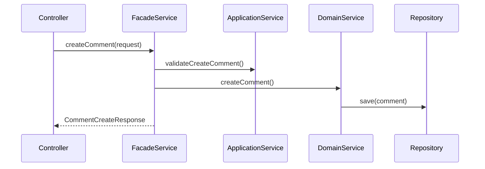
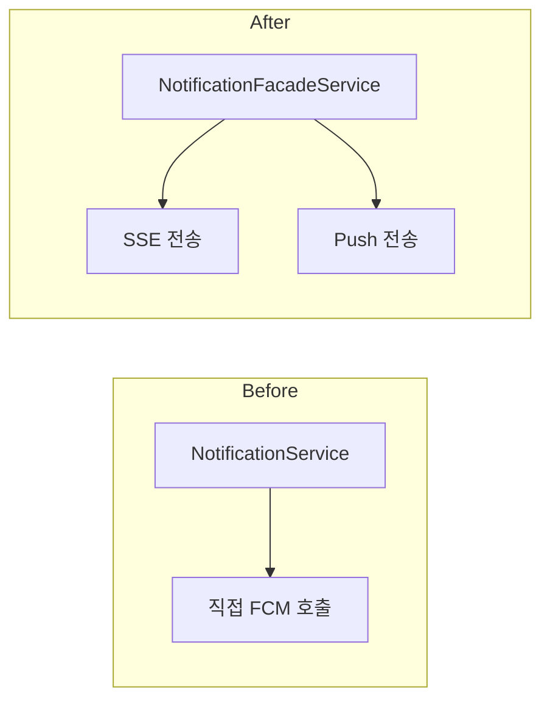
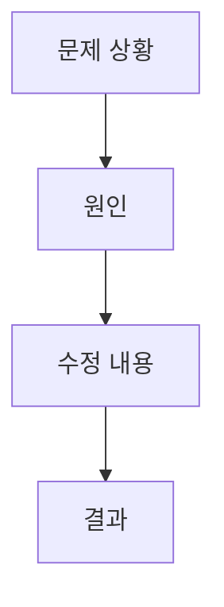

# Change Report

Git diff와 커밋 메시지를 분석하고, 코드베이스를 탐색하여 변경 사항 보고서를 `docs/reports/` 하위에 생성한다.

## Workflow

1. **변경 범위 감지**: git 상태를 분석하여 적절한 diff 범위 자동 결정
2. **변경 분석**: diff + 커밋 메시지를 파싱하여 변경 유형 분류
3. **코드베이스 탐색**: 변경된 파일과 관련 코드를 읽고 흐름 파악
4. **보고서 생성**: 템플릿 기반으로 보고서 작성 및 저장

## Step 1: 변경 범위 자동 감지

```bash
# 1. 현재 브랜치 확인
git branch --show-current

# 2. 범위 결정 (우선순위)
# a) main/master와 다른 브랜치에 있으면 → branch diff
git log main..HEAD --oneline
git diff main...HEAD --stat

# b) main 브랜치인데 staged 변경이 있으면 → staged diff
git diff --staged --stat

# c) unstaged 변경만 있으면 → working tree diff
git diff --stat
```

## Step 2: 변경 유형 분류

커밋 메시지 prefix와 diff 내용으로 변경 유형을 분류한다:

| 유형    | 커밋 prefix                    | 다이어그램                         |
|-------|------------------------------|-------------------------------|
| 새 기능  | `feat:`                      | sequenceDiagram (레이어 간 호출 흐름) |
| 리팩토링  | `refactor:`                  | flowchart (변경 전후 구조 비교)       |
| 버그 수정 | `fix:`                       | flowchart (원인→수정→결과 흐름)       |
| 성능 개선 | `perf:`                      | flowchart (최적화 포인트 표시)        |
| 기타    | `docs:`, `test:`, `chore:` 등 | 생략 가능                         |

혼합된 경우 가장 비중이 큰 유형의 다이어그램을 사용한다.
mixed일 때 다이어그램이 복수 필요하면 여러 개 포함한다.

## Step 3: 코드베이스 탐색

변경된 파일 목록에서:

1. 각 파일을 Read하여 변경 컨텍스트 파악
2. 호출 관계 추적 (Controller → Service → Repository 등)
3. 영향받는 다른 모듈/파일 탐색 (Grep으로 참조 검색)
4. 테스트 파일 확인 (해당 클래스의 테스트 존재 여부)
5. `git show main:{file_path}`로 변경 전 코드 확인 (before/after 비교용)

**병렬 탐색**: 독립적인 파일 읽기는 병렬로 수행하여 속도를 높인다.

## Step 4: 보고서 생성

### 저장 위치

```
docs/reports/{기능-디렉토리}/{브랜치명}.md
```

- 기능 디렉토리: 변경의 주요 도메인명 (예: `notification`, `auth`, `moment`)
- 브랜치명에서 `/`는 `_`로 치환 (예: `refactor/#1055` → `refactor_#1055.md`)
- 동일 파일 존재 시 `_v2`, `_v3` 접미사 추가

### 보고서 구조

보고서 템플릿 상세는 [references/report-template.md](references/report-template.md) 참조.

핵심 섹션:

1. **개요** - 한 줄 요약 + 변경 유형 + 브랜치/커밋 정보
2. **변경 요약 테이블** - 파일별 변경 내용과 `file:line` 링크
3. **상세 변경 내용** - 도메인/모듈별 그룹핑, before/after 코드 비교
4. **아키텍처 다이어그램** - Mermaid 다이어그램 (유형별 자동 선택)
5. **영향 범위 분석** - 변경으로 영향받는 다른 모듈/파일
6. **테스트 현황** - 관련 테스트 파일, 커버리지 상태
7. **잠재적 이슈** - 주의할 점, 사이드 이펙트 가능성

### 코드 링크 형식

모든 파일 참조에 `file_path:line_number` 형식 사용:

```markdown
- `src/main/java/moment/notification/service/facade/NotificationFacadeService.java:42`
```

상대 경로 사용 (`server/` 이후 경로, 프로젝트 소스 루트 기준).

### Mermaid 다이어그램 규칙

**새 기능 (sequenceDiagram):**



**리팩토링 (flowchart):**



**버그 수정 (flowchart):**



### Before/After 코드 비교 주의사항

- 코드 블록 내 Java 코드는 **원본 포맷팅을 그대로 유지**한다
- 린터가 코드 블록 내부를 자동 포맷할 수 있으므로, 한 줄에 들어갈 코드는 줄바꿈 없이 한 줄로 작성한다
- 메서드 체이닝(`if(!a.equals(b))`)이 여러 줄로 분리되지 않도록 주의한다
- 핵심 변경 지점만 선별하여 발췌한다 (전체 파일 복사 금지)
- 삭제된 파일의 before 코드는 `git show main:{file_path}`로 가져온다

예시:

```markdown
**Before** (`src/main/.../NotificationService.java:35`)

```java
public void sendNotification(Long userId, String message) {
    fcmClient.send(userId, message);
}
```

**After** (`src/main/.../NotificationFacadeService.java:42`)

```java
public void notify(NotificationCommand command) {
    notificationApplicationService.createNotification(command.userId(), command.targetId(), ...)
    sseNotificationService.sendToClient(command.userId(), "notification", ...);
    pushNotificationApplicationService.sendToDeviceEndpoint(command.userId(), command.pushMessage());

```

```

### 커밋별 Phase 그룹핑

커밋이 여러 개인 경우, 논리적 단위(Phase)로 그룹핑하여 상세 변경 내용을 작성한다.
커밋 순서(시간순)와 Phase 순서를 일치시킨다.
각 Phase 제목은 해당 작업의 핵심을 요약한다.

### 다중 도메인 변경 시

변경이 여러 도메인에 걸쳐 있을 경우:
- 가장 비중이 큰 도메인을 기능 디렉토리로 사용한다
- 상세 변경 내용은 도메인별로 그룹핑한다
- 영향 범위 분석에서 크로스 도메인 영향을 명시한다
