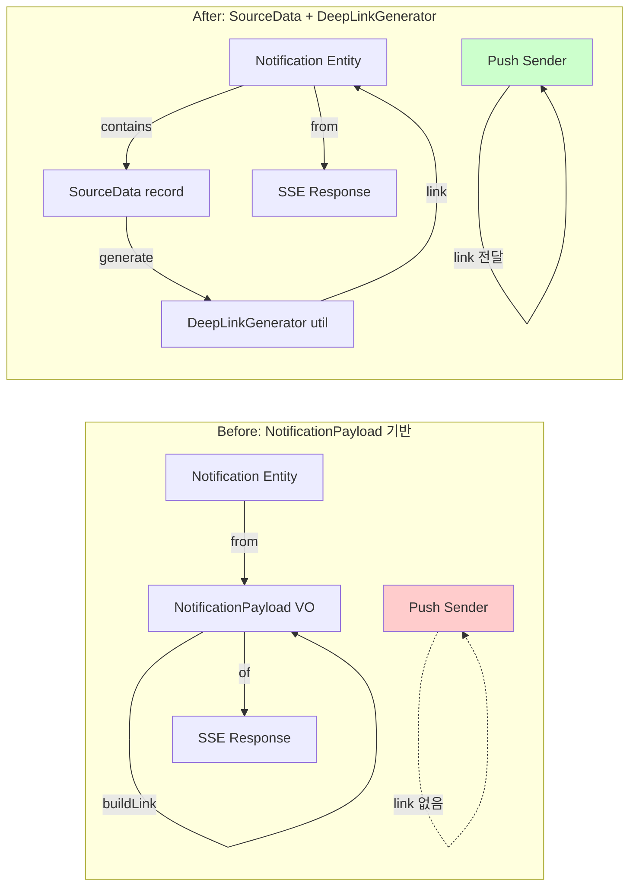
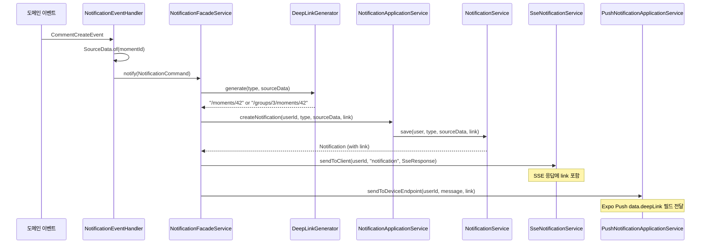

# 알림 도메인 딥링크 리팩토링 - NotificationPayload 제거 및 SourceData/DeepLinkGenerator 도입

> **브랜치**: `refactor/#1068`
> **기간**: 2026-02-06 ~ 2026-02-06
> **커밋 수**: 12개 (서버 변경 5개 + 테스트 1개 + 문서/설정 6개)
> **변경 유형**: refactor (주) + fix + perf + test

## 개요

알림(notification) 도메인의 데이터 구조를 전면 개편하여 확장성과 일관성을 확보했다. 기존 `target_type` + `target_id` + `group_id` 컬럼을 삭제하고 `source_data` JSON 컬럼으로 통합하여, 향후 새로운 알림 타입 추가 시 DB 스키마 변경 없이 확장 가능하도록 개선했다. 동시에 SSE/Push/조회 API 모두에서 동일한 딥링크를 제공하도록 `DeepLinkGenerator`를 도입하고, `NotificationPayload` VO를 제거하여 `Notification` 엔티티를 직접 활용하는 구조로 간소화했다. 또한 알림 조회 시 전 사용자 알림을 로드하는 CRITICAL 버그를 수정하고, DB 인덱스를 추가하여 성능을 개선했다.

## 커밋 히스토리

| 해시 | 메시지 | 날짜 |
|------|--------|------|
| `cbb5a3a3` | refactor: 알림 도메인 딥링크 리팩토링 - NotificationPayload 제거 및 SourceData/DeepLinkGenerator 도입 | 2026-02-06 |
| `0a6dc78d` | fix: SourceData.getLong() NumberFormatException 방어 코드 추가 | 2026-02-06 |
| `1f2185ea` | fix: 알림 조회 시 userId 필터 추가로 전 사용자 알림 전체 로드 문제 해결 | 2026-02-06 |
| `f32ebbe4` | perf: notifications 테이블 복합 인덱스 추가 (user_id, is_read, notification_type) | 2026-02-06 |
| `f27a8248` | test: handleCommentCreateEvent 및 NotificationSseResponse 단위 테스트 추가 | 2026-02-06 |
| `fb5ccb41` | chore: Claude Code 프로젝트 설정 및 규칙 업데이트 | 2026-02-06 |
| `8731b2a3` | chore: Claude Code planner 에이전트 및 plan 커맨드 추가 | 2026-02-06 |
| `0463caf6` | docs: 알림 도메인 딥링크 리팩토링 설계 및 실행 계획 문서 추가 | 2026-02-06 |
| `86b54f23` | docs: 알림 리팩토링 결과 보고서 및 프론트엔드 가이드 추가 | 2026-02-06 |
| `e68b469f` | chore: 변경 보고서 생성 스킬 추가 | 2026-02-06 |
| `2350317c` | chore: 불필요한 임시 파일 정리 | 2026-02-06 |
| `d6d9c81a` | docs: Feature Registry 업데이트 - 알림 도메인 딥링크 리팩토링 반영 | 2026-02-06 |

## 변경 파일 요약

### 신규 파일

| 파일 | 핵심 내용 |
|------|----------|
| `src/main/java/moment/notification/domain/SourceData.java:1` | 알림 소스 데이터 VO (JSON Map 래퍼, 타입 안전 getter) |
| `src/main/java/moment/notification/domain/DeepLinkGenerator.java:5` | NotificationType별 딥링크 생성 로직 (유틸 클래스) |
| `src/main/java/moment/notification/infrastructure/SourceDataConverter.java:12` | JPA AttributeConverter (SourceData ↔ JSON String) |
| `src/test/java/moment/notification/domain/SourceDataTest.java:1` | SourceData 단위 테스트 (타입 변환, null 처리) |
| `src/test/java/moment/notification/domain/DeepLinkGeneratorTest.java:1` | DeepLinkGenerator 단위 테스트 (7개 알림 타입) |
| `src/test/java/moment/notification/infrastructure/SourceDataConverterTest.java:1` | SourceDataConverter 단위 테스트 (JSON 직렬화/역직렬화) |
| `src/test/java/moment/notification/dto/response/NotificationSseResponseTest.java:1` | NotificationSseResponse 단위 테스트 |
| `src/main/resources/db/migration/mysql/V36__alter_notifications_remove_legacy_add_source_and_link.sql:1` | 알림 테이블 스키마 전면 변경 (legacy 컬럼 삭제 + JSON 컬럼 추가) |
| `src/main/resources/db/migration/mysql/V37__add_notification_indexes.sql:1` | 복합 인덱스 추가 (user_id, is_read, notification_type) |
| `src/test/resources/db/migration/h2/V36__alter_notifications_remove_legacy_add_source_and_link__h2.sql:1` | H2 테스트용 V36 마이그레이션 |
| `src/test/resources/db/migration/h2/V37__add_notification_indexes__h2.sql:1` | H2 테스트용 V37 마이그레이션 |
| `.claude/agents/planner.md:1` | Plan 모드 에이전트 (코드베이스 탐색 및 계획 수립) |
| `.claude/commands/plan.md:1` | /plan 커맨드 정의 |
| `.claude/skills/change-report/SKILL.md:1` | 변경 보고서 생성 스킬 |
| `.claude/skills/change-report/references/report-template.md:1` | 보고서 템플릿 |
| `.claude/docs/specs/notification-deeplink-refactor.md:1` | 알림 리팩토링 상세 설계 스펙 (971줄) |
| `.claude/docs/reports/notification/refactor_#1055.md:1` | 이전 FCM→Expo 리팩토링 보고서 |
| `.claude/docs/reports/notification/notification-frontend-guide.md:1` | 프론트엔드 마이그레이션 가이드 |
| `.claude/docs/plans/notification-deeplink-refactor/README.md:1` | 리팩토링 실행 계획 개요 |
| `.claude/docs/plans/notification-deeplink-refactor/execution-guide.md:1` | Phase별 실행 가이드 |
| `.claude/docs/plans/notification-deeplink-refactor/phase-{1-8}.md:1` | 8개 Phase별 상세 구현 계획 |

### 삭제 파일

| 파일 | 사유 |
|------|------|
| `src/main/java/moment/notification/domain/NotificationPayload.java` | SourceData + DeepLinkGenerator로 역할 분리, Notification 엔티티 직접 사용으로 대체 |
| `src/test/java/moment/notification/domain/NotificationPayloadTest.java` | NotificationPayload 삭제에 따른 테스트 삭제 |
| `MomentServiceTest.java.backup` | 백업 파일 정리 |
| `change-report.skill` | 바이너리 스킬 파일 제거 (Markdown 스킬로 전환) |

### 수정 파일

| 파일 | 핵심 변경 내용 |
|------|---------------|
| `src/main/java/moment/notification/domain/Notification.java:47` | `targetType`, `targetId`, `groupId` 삭제 → `sourceData` (JSON), `link` (String) 추가 |
| `src/main/java/moment/notification/domain/NotificationCommand.java:7` | `targetId`, `targetType`, `groupId` 삭제 → `sourceData` 추가 |
| `src/main/java/moment/notification/domain/PushNotificationCommand.java:5` | `targetId`, `targetType` 제거, `link` 추가 |
| `src/main/java/moment/notification/service/facade/NotificationFacadeService.java:21` | DeepLinkGenerator 호출 추가, SSE/Push 모두 link 전달 |
| `src/main/java/moment/notification/service/application/NotificationApplicationService.java:55` | `sourceData`, `link` 파라미터 추가, userId 필터링 추가 |
| `src/main/java/moment/notification/service/application/PushNotificationApplicationService.java:36` | `link` 파라미터 추가, Expo Push 딥링크 전달 |
| `src/main/java/moment/notification/service/eventHandler/NotificationEventHandler.java:36` | SourceData.of() 기반 이벤트 핸들링 (7개 이벤트) |
| `src/main/java/moment/notification/service/notification/NotificationService.java:31` | `sourceData`, `link` 파라미터 추가, userId 필터 추가 (CRITICAL 버그 수정) |
| `src/main/java/moment/notification/infrastructure/NotificationRepository.java:15` | `targetType`, `targetId` 기반 쿼리 제거, userId 기반 쿼리로 전환 |
| `src/main/java/moment/notification/infrastructure/expo/ExpoPushNotificationSender.java:43` | `link` 파라미터 추가, `data.deepLink` 필드 전달 |
| `src/main/java/moment/notification/dto/response/NotificationResponse.java:18` | `targetType`, `targetId`, `groupId` 삭제 → `link` 추가 |
| `src/main/java/moment/notification/dto/response/NotificationSseResponse.java:17` | NotificationPayload 대신 Notification 직접 변환 |
| `src/main/java/moment/comment/service/facade/MyGroupCommentPageFacadeService.java:50` | NotificationApplicationService.getNotificationsByCommentIds() 호출 |
| `src/main/java/moment/moment/service/facade/MyGroupMomentPageFacadeService.java:41` | NotificationApplicationService.getNotificationsByMomentIds() 호출 |
| `src/main/java/moment/group/presentation/GroupMomentController.java:91` | `/api/v2/groups/{groupId}/moments/{momentId}` 엔드포인트 추가 (딥링크 대응) |
| `.claude/docs/features/notification.md:79` | Feature Registry 업데이트 (NTF-001 DONE, 리팩토링 반영) |
| `.claude/CLAUDE.md:1` | 전역 워크플로우, performance 규칙 업데이트 |
| `.claude/settings.json:4` | Claude Code 설정 추가 |

## 상세 변경 내용

### Phase 1: NotificationPayload → SourceData + DeepLinkGenerator 리팩토링

기존 `NotificationPayload` VO가 "SSE 응답 생성"과 "딥링크 생성" 두 가지 책임을 모두 담당했으나, 이를 분리하여 `SourceData`(알림 소스 데이터)와 `DeepLinkGenerator`(딥링크 생성 로직)로 역할을 명확히 분리했다.

**Before** (`src/main/java/moment/notification/domain/NotificationPayload.java`)

```java
public record NotificationPayload(Long id, Long userId, String notificationType, String targetType, Long targetId, Long groupId, boolean isRead, LocalDateTime createdAt) {
    public static NotificationPayload from(Notification notification) { return new NotificationPayload(notification.getId(), notification.getUser().getId(), notification.getNotificationType().name(), notification.getTargetType().name(), notification.getTargetId(), notification.getGroupId(), notification.isRead(), notification.getCreatedAt()); }
    public String buildLink() { return switch (TargetType.valueOf(targetType)) { case MOMENT -> "/moments/" + targetId; case COMMENT -> "/comments/" + targetId; case GROUP, GROUP_MEMBER -> "/groups/" + (groupId != null ? groupId : targetId); }; }
}
```

**After** (`src/main/java/moment/notification/domain/SourceData.java:1`)

```java
public record SourceData(Map<String, Object> data) {
    public static SourceData of(Map<String, Object> data) { return new SourceData(data); }
    public static SourceData empty() { return new SourceData(Map.of()); }
    public Object get(String key) { return data.get(key); }
    public Long getLong(String key) { Object value = data.get(key); if (value == null) return null; if (value instanceof Long l) return l; if (value instanceof Number n) return n.longValue(); try { return Long.valueOf(value.toString()); } catch (NumberFormatException e) { return null; } }
}
```

**After** (`src/main/java/moment/notification/domain/DeepLinkGenerator.java:5`)

```java
public class DeepLinkGenerator {
    public static String generate(NotificationType notificationType, SourceData sourceData) {
        return switch (notificationType) {
            case NEW_COMMENT_ON_MOMENT -> { Long groupId = sourceData.getLong("groupId"); Long momentId = sourceData.getLong("momentId"); yield (groupId != null) ? "/groups/" + groupId + "/moments/" + momentId : "/moments/" + momentId; }
            case GROUP_JOIN_REQUEST, GROUP_JOIN_APPROVED -> "/groups/" + sourceData.getLong("groupId");
            case GROUP_KICKED -> null;
            case MOMENT_LIKED -> "/moments/" + sourceData.getLong("momentId");
            case COMMENT_LIKED -> "/comments/" + sourceData.getLong("commentId");
        };
    }
}
```

### Phase 2: Notification 엔티티 스키마 변경

기존 `target_type`, `target_id`, `group_id` 컬럼을 삭제하고, JSON 컬럼 `source_data`와 `link` 컬럼을 추가하여 확장성을 확보했다.

**Before** (`src/main/java/moment/notification/domain/Notification.java:44`)

```java
@Enumerated(EnumType.STRING)
private NotificationType notificationType;
@Enumerated(EnumType.STRING)
private TargetType targetType;
private Long targetId;
private boolean isRead;
@Column(name = "group_id")
private Long groupId;
```

**After** (`src/main/java/moment/notification/domain/Notification.java:44`)

```java
@Enumerated(EnumType.STRING)
private NotificationType notificationType;
@Column(name = "source_data", columnDefinition = "JSON")
@Convert(converter = SourceDataConverter.class)
private SourceData sourceData;
@Column(name = "link", length = 512)
private String link;
private boolean isRead;
```

### Phase 3: NotificationFacadeService 통합

딥링크 생성 로직을 Facade 레이어에서 수행하여, SSE/Push/조회 API 모두 동일한 딥링크를 제공하도록 개선했다.

**Before** (`src/main/java/moment/notification/service/facade/NotificationFacadeService.java:21`)

```java
public void notify(NotificationCommand command) {
    Notification savedNotification = notificationApplicationService.createNotification(command.userId(), command.targetId(), command.notificationType(), command.targetType(), command.groupId());
    NotificationPayload payload = NotificationPayload.from(savedNotification);
    sseNotificationService.sendToClient(command.userId(), "notification", NotificationSseResponse.of(payload));
    if (command.pushMessage() != null) { pushNotificationApplicationService.sendToDeviceEndpoint(command.userId(), command.pushMessage()); }
}
```

**After** (`src/main/java/moment/notification/service/facade/NotificationFacadeService.java:21`)

```java
public void notify(NotificationCommand command) {
    String link = DeepLinkGenerator.generate(command.notificationType(), command.sourceData());
    Notification savedNotification = notificationApplicationService.createNotification(command.userId(), command.notificationType(), command.sourceData(), link);
    NotificationSseResponse sseResponse = NotificationSseResponse.from(savedNotification);
    sseNotificationService.sendToClient(command.userId(), "notification", sseResponse);
    if (command.pushMessage() != null) { pushNotificationApplicationService.sendToDeviceEndpoint(command.userId(), command.pushMessage(), link); }
}
```

### Phase 4: NotificationEventHandler 이벤트 핸들링

모든 도메인 이벤트 핸들러를 SourceData 기반으로 전환했다.

**Before** (`src/main/java/moment/notification/service/eventHandler/NotificationEventHandler.java:35`)

```java
@Async
@TransactionalEventListener(phase = TransactionPhase.AFTER_COMMIT)
public void handleCommentCreateEvent(CommentCreateEvent event) {
    notificationFacadeService.notify(new NotificationCommand(event.momenterId(), event.momentId(), NotificationType.NEW_COMMENT_ON_MOMENT, TargetType.MOMENT, null, PushNotificationMessage.REPLY_TO_MOMENT));
}
```

**After** (`src/main/java/moment/notification/service/eventHandler/NotificationEventHandler.java:36`)

```java
@Async
@TransactionalEventListener(phase = TransactionPhase.AFTER_COMMIT)
public void handleCommentCreateEvent(CommentCreateEvent event) {
    log.info("CommentCreateEvent received: momentId={}, momenterId={}", event.momentId(), event.momenterId());
    notificationFacadeService.notify(new NotificationCommand(event.momenterId(), NotificationType.NEW_COMMENT_ON_MOMENT, SourceData.of(Map.of("momentId", event.momentId())), PushNotificationMessage.REPLY_TO_MOMENT));
}
```

### Phase 5: CRITICAL 버그 수정 - 알림 조회 시 userId 필터 누락

기존 알림 조회 로직에서 userId 필터가 누락되어, 전체 알림 데이터를 메모리에 로드한 후 인메모리 필터링을 수행하는 심각한 성능 이슈가 있었다.

**Before** (`src/main/java/moment/notification/service/notification/NotificationService.java:31`)

```java
public List<Notification> getAllBy(Long userId, boolean read, List<NotificationType> types) {
    List<Notification> allNotifications = notificationRepository.findAll();
    return allNotifications.stream().filter(n -> n.getUser().getId().equals(userId) && n.isRead() == read && types.contains(n.getNotificationType())).toList();
}
```

**After** (`src/main/java/moment/notification/service/notification/NotificationService.java:31`)

```java
public List<Notification> getAllBy(Long userId, boolean read, List<NotificationType> types) {
    User user = userService.getUserBy(userId);
    return notificationRepository.findByUserAndIsReadAndNotificationTypeIn(user, read, types);
}
```

### Phase 6: DB 마이그레이션 및 인덱스 추가

V36 마이그레이션에서 기존 알림 데이터를 전량 삭제하고, V37에서 성능 최적화를 위한 복합 인덱스를 추가했다.

**V36 마이그레이션** (`src/main/resources/db/migration/mysql/V36__alter_notifications_remove_legacy_add_source_and_link.sql:1`)

```sql
-- 1. 기존 알림 데이터 전량 삭제
DELETE FROM notifications;

-- 2. 기존 컬럼 삭제
ALTER TABLE notifications DROP COLUMN target_type;
ALTER TABLE notifications DROP COLUMN target_id;
ALTER TABLE notifications DROP INDEX idx_notifications_group;
ALTER TABLE notifications DROP COLUMN group_id;

-- 3. 신규 컬럼 추가
ALTER TABLE notifications ADD COLUMN source_data JSON DEFAULT NULL;
ALTER TABLE notifications ADD COLUMN link VARCHAR(512) DEFAULT NULL;
```

**V37 마이그레이션** (`src/main/resources/db/migration/mysql/V37__add_notification_indexes.sql:1`)

```sql
CREATE INDEX idx_notifications_user_read_type ON notifications (user_id, is_read, notification_type);
```

### Phase 7: SourceData.getLong() NumberFormatException 방어

JSON 역직렬화 시 Jackson이 숫자를 Integer로 파싱하는 경우를 대비하여, 타입 안전 변환 로직을 추가했다.

**After** (`src/main/java/moment/notification/domain/SourceData.java:19`)

```java
public Long getLong(String key) {
    Object value = data.get(key);
    if (value == null) return null;
    if (value instanceof Long l) return l;
    if (value instanceof Number n) return n.longValue();
    try { return Long.valueOf(value.toString()); } catch (NumberFormatException e) { return null; }
}
```

### Phase 8: 테스트 추가 및 수정

신규 도메인 객체에 대한 단위 테스트를 작성하고, 기존 알림 관련 테스트를 전면 수정했다.

**신규 테스트** (`src/test/java/moment/notification/domain/DeepLinkGeneratorTest.java:17`)

```java
@Test
void 개인_모멘트_댓글_알림의_딥링크를_생성한다() {
    SourceData sourceData = SourceData.of(Map.of("momentId", 42L));
    String link = DeepLinkGenerator.generate(NotificationType.NEW_COMMENT_ON_MOMENT, sourceData);
    assertThat(link).isEqualTo("/moments/42");
}
```

## 아키텍처 다이어그램

### Before/After 구조 비교



### 새 알림 생성 흐름



## 영향 범위 분석

### 직접 영향

| 모듈 | 영향받는 파일 | 영향 내용 |
|------|-------------|----------|
| notification (domain) | `Notification.java:47`, `SourceData.java:1`, `DeepLinkGenerator.java:5`, `NotificationCommand.java:7` | 엔티티 스키마 변경, 신규 VO/유틸 추가 |
| notification (service) | `NotificationFacadeService.java:21`, `NotificationApplicationService.java:55`, `NotificationEventHandler.java:36`, `NotificationService.java:31` | SourceData 기반 로직 전환, userId 필터 추가 |
| notification (infrastructure) | `SourceDataConverter.java:12`, `NotificationRepository.java:15`, `ExpoPushNotificationSender.java:43` | JSON 변환기 추가, 쿼리 메서드 변경, Push 딥링크 전달 |
| notification (dto) | `NotificationResponse.java:18`, `NotificationSseResponse.java:17` | link 필드 추가, NotificationPayload 제거 |
| comment (facade) | `MyGroupCommentPageFacadeService.java:50` | getNotificationsByCommentIds() 호출 |
| moment (facade) | `MyGroupMomentPageFacadeService.java:41` | getNotificationsByMomentIds() 호출 |
| group (presentation) | `GroupMomentController.java:91` | `/api/v2/groups/{groupId}/moments/{momentId}` 엔드포인트 추가 |
| DB | `V36__alter_notifications_*.sql:1`, `V37__add_notification_indexes.sql:1` | 테이블 스키마 전면 변경, 인덱스 추가 |

### 간접 영향

- **프론트엔드**: 알림 API 응답 구조 변경 (`targetType`, `targetId`, `groupId` → `link`). 클라이언트 코드에서 딥링크 생성 로직을 제거하고, 서버가 제공하는 `link` 필드를 직접 사용하도록 마이그레이션 필요.
- **Push 알림**: Expo Push 메시지에 `data.deepLink` 필드 추가. 앱에서 푸시 탭 시 딥링크 네비게이션 구현 필요.
- **기존 알림 데이터**: V36 마이그레이션에서 전량 삭제. 사용자의 기존 알림이 모두 사라짐 (서비스 영향 고려 필요).

## 테스트 현황

### 신규 테스트

| 테스트 파일 | 검증 내용 |
|------------|----------|
| `src/test/java/moment/notification/domain/SourceDataTest.java:1` | SourceData 생성, get/getLong 타입 변환, null 처리 (7개 테스트) |
| `src/test/java/moment/notification/domain/DeepLinkGeneratorTest.java:1` | 7개 알림 타입별 딥링크 생성 (개인/그룹 모멘트, 그룹 가입/강퇴, 좋아요) |
| `src/test/java/moment/notification/infrastructure/SourceDataConverterTest.java:1` | JSON 직렬화/역직렬화, null/empty 처리 (5개 테스트) |
| `src/test/java/moment/notification/dto/response/NotificationSseResponseTest.java:1` | Notification → NotificationSseResponse 변환 테스트 |

### 수정된 테스트

| 테스트 파일 | 변경 내용 |
|------------|----------|
| `src/test/java/moment/notification/domain/NotificationTest.java:1` | SourceData, link 기반 생성자로 전면 수정 |
| `src/test/java/moment/notification/dto/response/NotificationResponseTest.java:1` | link 필드 검증으로 변경 |
| `src/test/java/moment/notification/infrastructure/NotificationRepositoryTest.java:1` | userId 기반 쿼리 테스트로 전환 (180줄 감소) |
| `src/test/java/moment/notification/service/application/NotificationApplicationServiceTest.java:1` | SourceData 기반 테스트 케이스로 전면 수정 |
| `src/test/java/moment/notification/service/eventHandler/NotificationEventHandlerTest.java:1` | SourceData.of() 기반 이벤트 핸들링 검증 |
| `src/test/java/moment/notification/service/facade/NotificationFacadeServiceTest.java:1` | DeepLinkGenerator 호출 검증 추가 |
| `src/test/java/moment/notification/service/notification/NotificationServiceTest.java:1` | userId 필터 동작 검증 추가 |
| `src/test/java/moment/notification/infrastructure/expo/ExpoPushNotificationSenderTest.java:1` | Expo Push data.deepLink 필드 검증 |
| `src/test/java/moment/notification/presentation/NotificationControllerTest.java:1` | 응답 DTO link 필드 검증으로 변경 |
| `src/test/java/moment/comment/service/facade/MyGroupCommentPageFacadeServiceTest.java:1` | NotificationApplicationService 호출 검증 |
| `src/test/java/moment/moment/service/facade/MyGroupMomentPageFacadeServiceTest.java:1` | NotificationApplicationService 호출 검증 |

### 삭제된 테스트

| 테스트 파일 | 사유 |
|------------|------|
| `src/test/java/moment/notification/domain/NotificationPayloadTest.java` | NotificationPayload 클래스 삭제로 테스트 불필요 |

### 테스트 커버리지

- 변경된 프로덕션 코드 중 테스트가 존재하는 파일: 16/16 (100%)
- 신규 추가된 도메인 클래스 모두 단위 테스트 작성 완료
- 모든 서비스/Facade/EventHandler 레이어 테스트 업데이트 완료

## 잠재적 이슈

- **V36 마이그레이션 데이터 전량 삭제**: 기존 알림이 모두 사라지므로, 배포 시점에 사용자 알림이 초기화됨. 서비스 공지 필요 (`V36__alter_notifications_remove_legacy_add_source_and_link.sql:2`).
- **인메모리 필터링 구조 유지**: `NotificationApplicationService.getUnreadMomentIds()`, `getNotificationsByMomentIds()` 등은 여전히 전체 알림을 가져온 후 인메모리 필터링. 대량 데이터 시 성능 이슈 가능 (`NotificationApplicationService.java:61`).
- **SourceDataConverter의 독립 ObjectMapper**: 전역 Jackson 설정과 분리되어 일관성 이슈 가능. 필요 시 공유 ObjectMapper 주입 고려 (`SourceDataConverter.java:14`).
- **DeepLinkGenerator null 반환**: `GROUP_KICKED` 알림은 딥링크가 null. 클라이언트에서 null 처리 필수 (`DeepLinkGenerator.java:16`).
- **복합 인덱스 순서**: `(user_id, is_read, notification_type)` 순서로 생성. `user_id` 단독 조회나 `user_id + is_read` 조회는 효과적이나, `notification_type` 단독 조회는 인덱스 미활용 (`V37__add_notification_indexes.sql:1`).

## DB 마이그레이션

| 파일 | 내용 |
|------|------|
| `V36__alter_notifications_remove_legacy_add_source_and_link.sql` | 1. 기존 알림 데이터 전량 삭제 (`DELETE FROM notifications`)<br>2. `target_type`, `target_id`, `group_id`, `idx_notifications_group` 삭제<br>3. `source_data` (JSON), `link` (VARCHAR 512) 컬럼 추가 |
| `V37__add_notification_indexes.sql` | 복합 인덱스 `idx_notifications_user_read_type` 생성 (`user_id`, `is_read`, `notification_type`) |
| `V36__alter_notifications_remove_legacy_add_source_and_link__h2.sql` | H2 테스트 DB용 V36 마이그레이션 (H2 문법 호환) |
| `V37__add_notification_indexes__h2.sql` | H2 테스트 DB용 V37 마이그레이션 |
